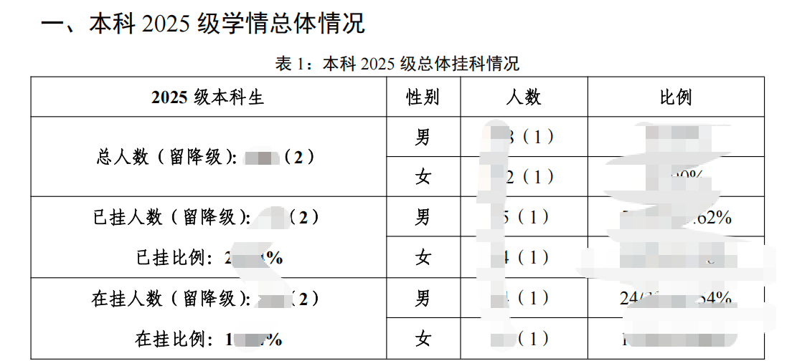
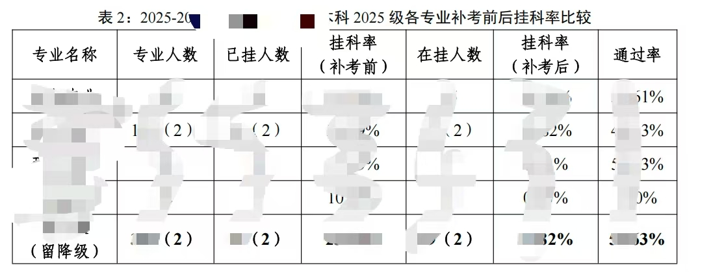
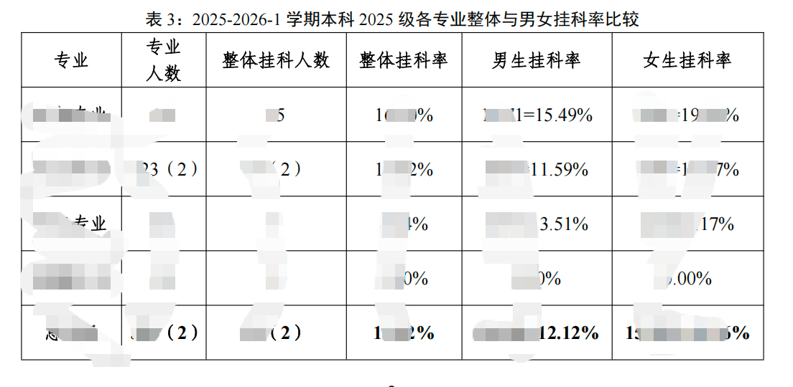
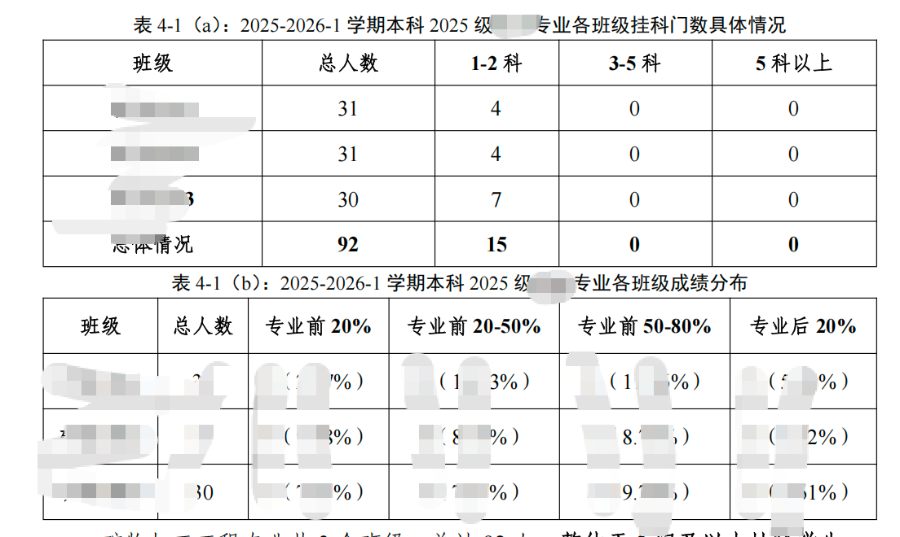
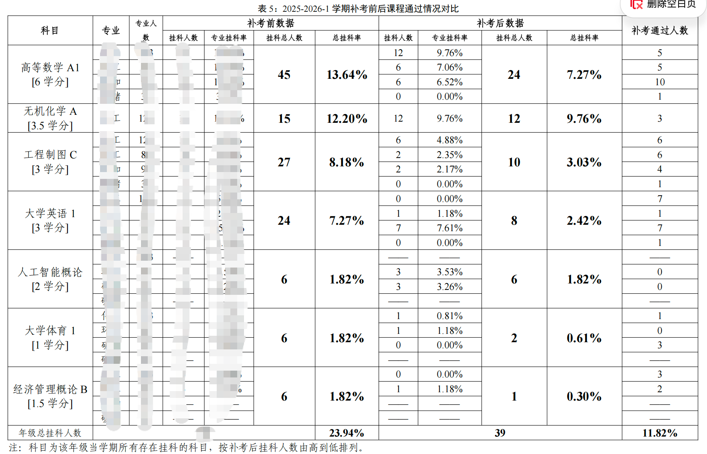
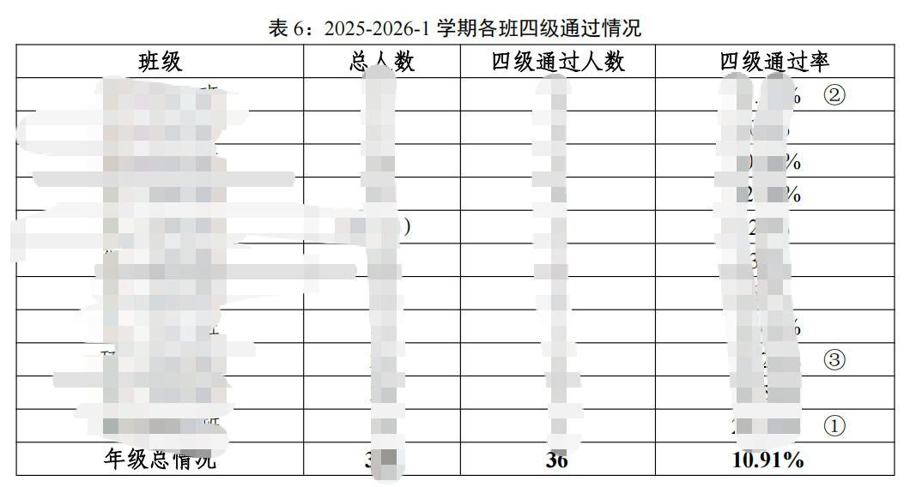
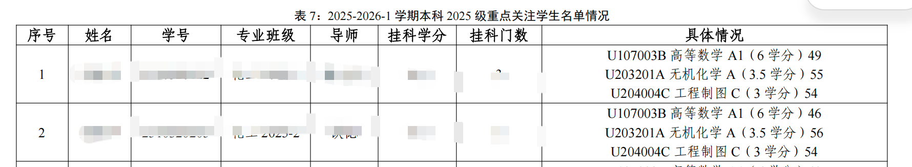
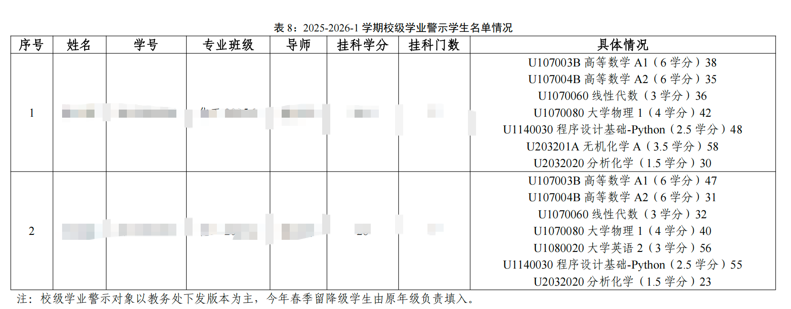

# 0728基础报表需求

## 1. 文档信息

| 项目 | 内容 |
|---|---|
| 文档名称 | 0728基础报表需求 |
| 文档版本 | V1.12 |
| 编制日期 | 2026-07-28 |
| 最近更新 | 2026-08-09 |
| 需求来源 | 用户提供的 8 张报表截图 |
| 报表数量 | 9 张独立报表，其中第 7 张图片包含 2 张报表 |
| 文档状态 | 第一阶段实现中；RPT-07、RPT-08 已按共用 R2/R2W 活动预警口径实现，规则阈值及其他新增口径仍待业务部门确认 |

## 2. 建设目标

将本科各入学年级学情统计材料中的基础报表转化为系统可查询、可核查、可导出的通用报表，覆盖总体挂科、补考前后变化、性别差异、班级分布、课程补考、大学英语四级、重点关注学生和校级学业警示等场景。来源图片中的 2025 级仅作为示例数据范围，系统实现不得将年级写死。

本需求只定义事实报表及名单查询，不扩展为自动预警处置、自动通知或学生工作管理功能。

## 3. 报表清单

| 编号 | 报表名称 | 来源图片 | 是否包含学生明细 |
|---|---|---|---|
| RPT-01 | 本科指定入学年级总体挂科情况 | 图片 5，原表 1 | 否 |
| RPT-02 | 各专业补考前后挂科率比较 | 图片 8，原表 2 | 否 |
| RPT-03 | 本科指定入学年级各专业整体与男女挂科率比较 | 图片 6，原表 3 | 否 |
| RPT-04A | 各班级挂科门数具体情况 | 图片 7，原表 4-1（a） | 否 |
| RPT-04B | 本科指定入学年级各班级成绩分布 | 图片 7，原表 4-1（b） | 否 |
| RPT-05 | 本科可选年级补考前后课程通过情况对比 | 图片 1，原表 5 | 否 |
| RPT-06 | 各班大学英语四级通过情况 | 图片 2，原表 6 | 否 |
| RPT-07 | 重点关注学生名单 | 图片 3，原表 7 | 是 |
| RPT-08 | 校级学业警示学生名单 | 图片 4，原表 8 | 是 |

## 4. 共性需求

### 4.1 查询条件

| 条件 | 要求 |
|---|---|
| 学年学期 | 必选，从当前权限范围内有数据的学期中选择；来源图片使用 `2025-2026-1` 示例，标题随选择值变化 |
| 培养层次 | 默认“本科” |
| 入学年级/年级 | 默认必选；RPT-05、RPT-07、RPT-08 为可选。选项来自当前权限范围内有数据的入学年级；来源图片使用 `2025` 级示例，但系统不得固定为 2025 级 |
| 学院 | 按当前用户数据权限提供选择范围；RPT-04A 可选，RPT-04B 必选 |
| 专业 | 支持按学院联动筛选；RPT-04A 可选，RPT-04B 必选 |
| 班级 | 在支持班级查询的报表中可选 |
| 数据截止时间 | 查询响应和 Excel“报表说明”必须记录对应数据截止时间；RPT-06 按精简页面设计不单独展示上下文条，截止信息保留在导出说明和接口响应中 |

### 4.2 数据范围与权限

1. 校级角色和现有系统管理员账号可查看全校聚合数据。
2. 二级学院可查看本学院专业、班级和学生明细；跨学院只允许查看已授权的聚合对比结果。
3. 辅导员、班主任和导师只能查看其有效人员关系范围内的班级或学生。
4. RPT-07、RPT-08 包含姓名、学号、导师和成绩，列表查询、详情、导出及直接接口访问均须在服务端重新鉴权。
5. 导出文件应记录导出人、当前工作身份、筛选范围、导出时间和数据版本。

### 4.3 数据与显示规则

1. 人数按学生去重；课程人数按“学生—课程”去重。若业务改用成绩记录人次，字段名称必须明确包含“人次”。
2. 课程使用课程代码作为稳定标识，课程名称和学分取统计学期对应的有效课程信息。
3. 班级、专业和导师按统计时点的有效关系确定；留级、降级学生的组织归属规则须由教务处签字确认。
4. 百分比统一保留 2 位小数。分母为 0 或数据缺失时显示“—”，不得显示为 `0.00%`。
5. 人数为 0 时显示 `0`；不适用或尚无数据时显示“—”，两者不得混用。
6. 汇总行使用去重后的原始明细重新计算，不得直接累加已四舍五入的百分比。
7. 报表标题至少包含学年学期；必选年级的报表同时显示年级。RPT-07、RPT-08 仅在选择年级时显示年级；其他范围字段按各报表标题模板生成。RPT-06 标题不显示“本科”，学院、专业、班级只在已选择时按顺序显示。
8. 页面或 Excel“报表说明”须披露分析范围、数据截止时间、数据来源和口径版本；RPT-06 的页面只在结果标题披露已选范围，其余信息写入 Excel“报表说明”和接口响应。
9. 支持按当前筛选条件导出 Excel；名单报表的导出权限与页面明细权限一致。
10. 图片中被打码的专业、班级、姓名、学号、导师和人数均视为动态业务数据，不在需求文档中固化。
11. 查询条件与结果字段严格分离：学院、专业、年级等字段即使是必选查询条件，只要原始报表没有对应结果列，就不得自动添加到结果表中；所选条件在标题和查询上下文中披露。
12. 九张报表均不分页，查询后一次展示当前授权范围及筛选条件下的全部结果；页面与 Excel 使用相同排序、合并单元格和汇总规则。
13. 首次进入报表页、切换报表或重置条件后不得自动查询。结果区保留该报表原始表头，表体为空；只有用户完整填写该报表全部必选条件并点击“查询”后才加载内容。
14. 原始报表存在分组表头或纵向合并单元格时，页面与 Excel 必须同步复刻；用于合并的结果必须先按稳定分组键排序，不能因排序导致同组数据被拆散。

### 4.4 与现有平台指标口径的关系

现有《本科教学分析与学业决策支持平台需求调研及指标口径确认书 V2》已经定义以下相关指标：

| 现有指标 | 本批报表的使用要求 |
|---|---|
| O-10 当前挂科学生率 | 当前学期至少 1 门明确未通过的去重学生数 ÷ 当前学期至少 1 条有效成绩的去重学生数 |
| O-20 重点课程受影响学生数 | 某课程至少 1 条明确未通过成绩的去重学生数 |
| O-22 课程最终有效未通过率 | 对每名学生取该课程最后一条真实有效结果后，未通过学生数 ÷ 最终有效结果学生数 |
| G-07 历史挂科经历学生数 | 历史上曾出现至少 1 次未通过成绩的学生数，后续通过仍保留历史经历标识 |
| G-09 当前未解决课程数 | 曾经未通过且截至统计时点仍未取得通过成绩的去重课程数 |
| G-10 当前未解决学生数 | 当前未解决课程数大于等于 1 的学生数 |
| G-13 补考通过率 | 结果明确的补考通过人次 ÷ 结果明确的补考人次 |
| G-18 成绩改善率 | 后来取得通过成绩的“学生—课程”数 ÷ 曾经未通过的“学生—课程”数 |

图片中的“挂科率”“通过率”不得直接复用为无口径字段：

- RPT-02 原图“通过率”按已确认的专业学生口径实现为 `（专业人数－在挂人数）÷专业人数`，不表示 G-13 补考人次通过率；页面表头 Tooltip、接口和 Excel 使用同一公式。
- G-13 继续用于具有明确补考记录的补考人次分析及 RPT-05 的补考通过人数证据；不得与 RPT-02 的专业学生通过率混用。
- 年级、学院、专业和性别群体的挂科率原则上绑定 O-10 类学生受影响口径；RPT-02 按学校本次确认使用专业在校本科生总数作为补考前、补考后挂科率的共同分母。
- 课程挂科率绑定 O-22 类课程最终有效未通过口径，分母使用该课程最终有效结果学生数。
- 正式计算方法见 4.8 及各报表“统计计算规则”，确认后同步更新指标口径确认书。

### 4.5 统一角色与统计范围模型

报表必须使用用户的“当前工作身份”解析数据范围。一人拥有多个角色时，页面只使用当前身份对应的权限，不合并多个身份的数据范围；切换身份后应重新加载筛选项、统计结果、下钻权限和导出权限。

本需求以当前系统数据库 `sys_role` 已存在的角色为准，不新增角色。现有角色如下：

| 角色 ID | 当前系统显示名称 | 数据范围类型 |
|---|---|---|
| `school_leader` | 校领导 | 全校 |
| `dean` | 教务处处长 | 全校 |
| `dept_operation` | 教务处·运行科 | 全校 |
| `dept_research` | 教务处·教研科 | 全校 |
| `dept_practice` | 教务处·实践科 | 全校 |
| `quality_office` | 质量办/评估中心 | 全校 |
| `college_dean` | 二级学院·院长 | 学院 |
| `college_secretary` | 二级学院·教学秘书 | 学院 |
| `dept_director` | 系主任 | 专业 |
| `counselor` | 辅导员 | 班级 |
| `class_adviser` | 班主任 | 人员—班级关系 |
| `mentor` | 学业导师 | 导师—学生关系 |

当前系统没有可分配的 `teacher`（任课教师）角色，因此本批报表不为任课教师新增页面、权限或导出设计。代码中存在的任课教师范围预留不等于系统已经提供该角色。

“系统管理员”当前也不是独立角色 ID：现有 `admin` 账号复用 `dean` 角色，并通过 `system.manage` 等动作权限获得系统管理能力。本文提到“系统管理员账号”时，仅指这个现有账号能力，不要求新增 `system_admin` 角色。

本文后续所称“校级角色”仅指当前已有的校领导、教务处处长、教务处运行科、教务处教研科、教务处实践科和质量办/评估中心；具体报表准入仍由现有菜单权限和动作权限决定。

| 当前工作身份 | 默认统计范围 | 可切换范围 | 明细与比较边界 |
|---|---|---|---|
| 校级角色 | 全校 | 全校、指定学院、指定专业、指定班级 | 可查看全校聚合；学生明细仍按各角色现有菜单和动作权限控制 |
| 系统管理员账号 | 全校 | 全校、指定学院、指定专业、指定班级 | 复用现有 `dean` 角色的全校范围，同时受系统管理动作权限和导出审计约束 |
| 二级学院负责人、教学秘书 | 本学院 | 本学院、院内专业、院内班级 | 可查看本学院明细；指定报表可查看其他学院聚合对比，不得下钻其他学院学生 |
| 系主任或教研室主任 | 本专业 | 本专业及专业内班级 | 不得查看其他专业学生明细；跨专业聚合比较须另行授权 |
| 辅导员、班主任 | 有效“人员—行政班”关系覆盖的班级 | 所带全部班级或其中一个班级 | 只查看所带班级学生；不得以学院或专业筛选绕过班级范围 |
| 导师 | 有效“导师—学生”关系覆盖的学生 | 所带全部学生或单个学生 | 只查看所带学生，不显示未授权班级或专业的完整统计总体 |

补充规则：

1. “全校”“本学院”“本专业”“所带班级”“所带学生”均为服务端计算的数据范围，不允许前端自行拼接角色白名单。
2. 学院用户获得跨学院聚合比较权限时，只返回学院级或专业级汇总，不返回其他学院班级、学生、成绩和导出明细。
3. 辅导员、班主任和导师看到的比率，其分子、分母都必须限制在当前授权学生集合内，不得引用全校或学院分母。
4. 某角色虽有页面菜单，但没有有效班级、导师、课程或组织关系时，页面返回空范围说明，不得回退为全校。
5. 默认页面可在报表标题下方展示当前身份、统计范围、学年学期、年级、数据截止时间和口径版本；采用精简布局的报表按各报表专章省略重复上下文，相关信息保留在接口响应、Excel“报表说明”“口径规则”和指标口径管理中。
6. 全校报表出现同名专业或同名班级时，不在原表结果中临时增加列；通过查询条件区、标题、统计范围说明及导出说明记录学院/专业上下文，必要时要求先选学院或专业再查询。

### 4.6 统一查询、切换与下钻要求

1. **学年学期切换：** 学年学期为单选，选项只返回当前身份可见且已有数据的学期；页面不自动选择和查询，由用户选择后点击“查询”。
2. **入学年级切换：** 支持选择当前权限范围内任一具有有效数据的入学年级。原图格式报表以单个年级为一次查询范围，避免不同年级学制和课程结构混算。
3. **组织联动：** 选择学院后只加载该学院可见专业，选择专业后只加载该专业可见班级；无权限选项不返回前端。
4. **默认范围：** 数据权限范围仍由当前身份限定；页面不因默认范围而自动发起报表查询。学院、专业等必选条件应由用户明确选择，身份锁定值可只读展示但不得为空。
5. **范围切换：** 校级角色可从全校切换到指定学院继续查看同一张报表；学院角色不能把范围切换为全校。
6. **查询留痕：** 筛选条件写入 URL 或页面状态，刷新、合法下钻和返回时保持；切换身份后清除不再合法的筛选值。
7. **下钻链路：** 聚合数字可按“学校 → 学院 → 专业 → 班级 → 学生 → 课程证据”逐级下钻，但每一级都重新鉴权；没有明细权限时只显示不可下钻的聚合值。
8. **跨年级查看：** 支持分别切换年级查看；如后续增加跨年级对比，应另设对比视图并按同一指标、同一统计时点展示，不在一张原始格式表中直接合并。
9. **空数据状态：** 区分“当前范围无数据”“数据尚未同步”“无权限”和“分母为 0”，分别给出明确提示。
10. **结果加载：** 九张报表均不分页；后端返回当前授权范围与查询条件下的全部结果，并执行既有导出行数上限和性能保护。

### 4.7 统一 Excel 导出要求

1. 报表导出格式为 `.xlsx`，导出当前工作身份、当前筛选条件和当前授权范围内的全部结果；九张报表均无页面分页。
2. 导出按钮须同时校验页面动作权限和数据范围。直接调用导出接口时，后端必须重新计算权限，不信任前端传入的学院、专业、班级或学生 ID。
3. 当前文件名格式为 `{报表编号}_{报表名称}_{学年学期}_{年级标签}_{导出时间}.xlsx`；统计范围写入“报表说明”，不在文件名重复拼接。
4. 每个工作簿固定包含：
   - `报表结果`：与页面当前统计结果同口径的数据；
   - `报表说明`：当前身份、筛选条件、数据截止时间、口径版本、导出账号和边界说明；
   - `口径规则`：规则编号、来源类型、复用来源、计算方法和适用边界。
5. 学号、班级代码等可能包含前导零的字段按文本格式写入；独立人数列按整数写入，独立比率列按 Excel 百分比数值写入。原表字段本身要求“人数（占比）”复合展示时，页面和 Excel 均保留复合文本，不拆成隐藏结果列。
6. 合并表头、合并单元格、汇总行、默认排序和字段顺序必须与页面及原始报表一致；学院、专业、年级等仅作为查询条件时写入`报表说明`，不得擅自增加到`报表结果`。
7. 名单类导出不得因页面遮罩而改变原始值，但只能向有权限的用户提供；若字段策略要求脱敏，则页面、接口和 Excel 使用同一脱敏规则。
8. 每次导出写入审计日志，至少记录用户、当前身份、报表编号、筛选范围、导出行数、数据版本、发起时间和完成状态。
9. 超过系统同步导出阈值时转为后台任务，完成后在受控下载中心提供限时文件；下载时再次校验当前用户。
10. 导出数据与页面汇总不一致时，以同一查询快照重新生成，不允许页面和 Excel 分别读取不同数据版本。

### 4.8 统一统计计算基准

为保证 9 张报表跨年级、跨组织复用，所有计算必须先构造同一查询快照，不得在各页面分别实现一套年级或权限过滤逻辑。

#### 4.8.1 查询快照

一次查询快照由以下参数唯一确定：

`查询快照 = 当前工作身份 + 数据权限范围 + 学年学期 + 入学年级 + 组织筛选 + 数据截止时间 + 口径版本`

其中：

- **入学年级**是查询参数，例如 2023、2024、2025，不得写入代码常量。
- **统计学生集合 S**：同时满足本科、所选入学年级、统计时点学籍状态有效、当前身份有权查看、符合学院/专业/班级筛选的去重学生；用于类别总人数和男女主体人数。
- **有效成绩学生集合 E**：统计学生集合 S 中，在所选学期至少存在 1 条已发布、未作废且可判定通过状态成绩的学生。
- **有效学生—课程集合 V**：学生属于 S，课程属于所选学期，且该学生—课程至少存在 1 条有效成绩的去重组合。
- **组织归属**：默认使用统计截止时点的有效学院、专业和行政班关系；历史报表需要还原历史组织时，必须使用历史快照并明确标注。
- **留降级责任学生集合 D**：截至所选学期末存在正式“留级/降级”异动、仍为在校本科生、处于当前身份和组织筛选范围，且当前行政班责任年级等于所选年级的去重学生。D 作为原表括号口径单独计算，不要求其原入学年级等于所选年级，也不得在汇总后人工补数。

#### 4.8.2 成绩状态

对每个有效“学生—课程”组合，按成绩发布时间和业务修读类型确定：

| 状态 | 计算定义 |
|---|---|
| 首次有效结果 | 修读类型为首次修读的最早一条已发布、未作废且结果明确的成绩 |
| 补考有效结果 | 修读类型为补考的已发布、未作废且结果明确的成绩；多条记录按学校成绩覆盖规则选取 |
| 补考前未通过 | 首次有效结果为未通过 |
| 补考后已通过 | 补考前未通过，且截至统计截止时间存在有效补考通过结果 |
| 补考后仍未通过 | 补考前未通过，且截至统计截止时间没有有效补考通过结果 |
| 当前未解决课程 | 学生曾经未通过，且截至统计截止时间仍未取得学校认可的有效通过结果；同一课程多次未通过只计 1 门 |

成绩缺失、缓考、缺考、作弊、取消资格和成绩更正按学校确认的统一规则处理；在规则未签字前单列为“状态待确认”，不得静默计入通过或未通过。

#### 4.8.3 人数、门数和比率

1. 学生人数使用 `COUNT(DISTINCT student_id)`。
2. 课程门数使用 `COUNT(DISTINCT course_id)`；课程代码变更或替代关系按课程主数据映射后去重。
3. 学生—课程数使用 `COUNT(DISTINCT student_id, course_id)`，不得用成绩记录条数替代。
4. 年级、学院、专业和性别等学生群体挂科率默认使用已确认的统一分母；RPT-02 的补考前、补考后挂科率按本次确认使用专业在校本科生总数，其他报表继续按各自章节的有效成绩分母执行。
5. 课程未通过率的分母为当前课程具有最终有效结果的去重学生数，不使用整个专业或年级在籍人数。
6. 所有汇总行回到授权明细集合重新去重计算，不累加专业、班级或课程行。
7. 百分比内部至少保留 6 位小数，最终展示和 Excel 均四舍五入为 2 位；分母为 0 时结果为“—”。
8. 跨年级查看采用同一公式分别计算。不同年级结果可切换或进入独立对比视图，但不得把多个年级学生合并后称为某一个年级结果。

### 4.9 2026-07-31 第一阶段实现约束与口径决策

1. 本次只建设只读报表，不新增、补录、回写或维护业务数据；数据库迁移只登记菜单、默认授权、系统参数、指标定义和页面绑定。
2. 统计学生集合使用 V2 学生维度中“本科、在校、所选入学年级、当前身份授权范围”的去重学生；组织筛选继续受统一权限上下文约束，范围缺失时拒绝，不回退全校。
3. 成绩记录复用 `pass-stat-v1` 的有效记录和修读类型规则：已发布、未作废、`is_pass` 明确。RPT-02 的“通过率”使用 `（专业人数－在挂人数）÷专业人数`；G-13 继续用于真实补考记录口径，不得与 RPT-02 混用。
4. 补考/重修后的当前有效结果采用 `grade-effective-v1` 的查询时点变体 `basic-report-v1.1`：同一学生—课程存在通过结果时视为已通过，否则取最近未通过结果；该变体只查询计算，不落业务表。
5. RPT-04B 当前没有可直接复用的正式排名字段。`basic-report-v1.5` 在查询时计算学生学分加权平均分，并按稳定序号划分前 20%、20%—50%、50%—80%、后 20%区间，再回填班级统计。无有效成绩学生保留为接口内部核查字段，不进入页面和 Excel 的 6 列原表结果；正式综测排名及同分规则仍待学校确认。
6. RPT-06 查询时只读各学期源库 `external_exams`，按所选学期及以前的明确四级通过记录动态累计并按学生去重；不生成、不保存本地统计快照。源文件指纹仅用于防止查询后源数据变化时误导出旧结果，不属于业务快照。
7. RPT-07 与 RPT-08 是同一业务需求，仅报表编号、页面名称和结果标题末尾名称不同。两张报表均复用现有已发布活动预警 R2（最近 2 学期未解决课程不少于 3 门）和 R2W（最近 2 学期未解决课程等于 2 门）确定名单成员；课程证据按同一最近 2 学期口径复算，不同课程去重，已有通过记录的课程不再计入。本模块不生成或处置名单。
9. RPT-01 留降级人数复用 V2 `student_status_event` 正式学籍异动：只统计事件类型为“留级”或“降级”、`effective_at` 不晚于所选学期 `dim_semester.end_date` 的在校本科生，并继续受当前身份及组织范围约束。“保留学籍”不等同于留级，不计入。当前源表没有独立责任年级字段，`basic-report-v1.1` 暂按当前行政班中明确的年级段归入责任年级，无法解析时回退异动后的年级；该新规则已登记，后续接入正式责任年级字段后替换并升级版本。
10. 页面与 Excel 使用同一签名查询快照；数据文件、身份范围、筛选或口径版本发生变化时，旧快照导出返回冲突并要求重新查询。

## 5. 详细报表需求

### 5.1 RPT-01 本科指定入学年级总体挂科情况

#### 5.1.1 业务目的

从所选入学年级总体和性别结构两个层面展示补考前后挂科学生规模，说明留级、降级学生对统计总体的影响。报表适用于系统中所有具有有效数据的本科入学年级。

#### 5.1.2 标题模板

`{学年学期} 学期本科 {入学年级} 级总体挂科情况`

#### 5.1.3 表格结构

| 字段 | 内容与计算要求 | 展示要求 |
|---|---|---|
| 统计类别 | 总人数、已挂人数、在挂人数 | 固定显示 3 个类别 |
| 类别总人数 | 当前类别的去重学生数 | 在类别名称旁展示 |
| 其中留降级人数 | 当前类别中留级或降级学生数 | 类别单元格展示为“总人数（留降级：2）：2335”等格式；“2”是留降级人数，“2335”是类别总人数 |
| 类别比例 | 已挂人数或在挂人数 ÷ 当前学期有效成绩学生数 | 总人数不计算该比例；同步展示成绩覆盖率 |
| 性别 | 男、女 | 每个统计类别下分别展示 |
| 性别人数 | 当前类别、当前性别的去重学生数，并计算该性别中的留降级人数 | 按“人数（留降级人数）”展示，如“1516（2）”；1516 是男生总人数，2 是其中留降级男生人数 |
| 性别比例 | 当前性别人数 ÷ 当前类别总人数 | 百分比保留 2 位小数 |

#### 5.1.4 原始报表图片

> 说明：以下为需求来源原始图片。图片打码区域表示该位置存在实际业务内容，并非空值。

#### 5.1.5 术语要求

- “已挂人数”指补考前至少存在 1 门首次有效结果未通过的去重学生数。
- “在挂人数”指补考后仍至少存在 1 门当前未解决课程的去重学生数，对应 G-10。
- “留降级人数”指集合 D 的人数。类别主体人数仍按学生入学年级过滤；括号中的留降级人数按当前责任年级归入，因此留降级学生的原入学年级可以不同于所选年级。“保留学籍”不属于本指标。
- 正式系统统一采用当前学期有效成绩学生数作为挂科率分母，并同时展示年级总人数和成绩覆盖率。

#### 5.1.6 验收规则

1. 各类别的男生人数加女生人数等于该类别总人数；性别未说明人数大于 0 时须单独披露，不能静默造成不等式。
2. 各类别男、女括号内留降级人数之和等于该类别留降级人数；性别未说明的留降级人数存在时须单独披露。
3. 在挂人数不应大于已挂人数；如因成绩更正或迟到数据导致反例，页面须标注原因。
4. 点击已挂人数或在挂人数时，仅有明细权限的用户可进入对应学生名单。

#### 5.1.7 查询、角色视图与导出

**查询条件：** 学年学期、入学年级为必选；统计范围按角色提供全校、学院、专业、班级或所带学生选项；支持切换“补考前 / 补考后 / 同时对比”，默认同时对比。

| 角色 | 页面默认内容 | 可继续查看的内容 |
|---|---|---|
| 校级角色、系统管理员账号 | 所选年级的全校总体挂科情况 | 可切换某学院、专业或班级；可从人数下钻到授权学生及课程证据 |
| 二级学院 | 所选年级的本学院总体挂科情况 | 可切换院内专业、班级；不得查看其他学院学生明细 |
| 系主任 | 所选年级的本专业总体挂科情况 | 可切换专业内班级 |
| 辅导员、班主任 | 所带班级学生的总体挂科情况 | 可在“所带全部班级”和单个班级之间切换 |
| 导师 | 所带学生的挂科情况，标题显示“我的指导学生” | 可查看单个所带学生课程证据，不显示完整学院或专业总体 |

**Excel 导出：**

- `报表结果`按页面显示“统计类别 × 性别”结果，并包含统计范围字段。
- 有明细导出权限时增加`学生明细`，包含学生组织归属、已挂/在挂状态、留降级标识和当前未解决课程数。
- 校级导出选择“全校”时只导出全校总体；选择某学院时导出该学院结果，不自动混入其他学院。

#### 5.1.8 统计计算规则

设当前查询快照的统计学生集合为 S、有效成绩学生集合为 E：

| 指标 | 计算方法 |
|---|---|
| 年级总人数 | `COUNT(DISTINCT S.student_id)` |
| 有效成绩学生数 | `COUNT(DISTINCT E.student_id)` |
| 成绩覆盖率 | `有效成绩学生数 ÷ 年级总人数 × 100%` |
| 已挂人数 | E 中所选学期至少存在 1 个“补考前未通过”学生—课程组合的去重学生数 |
| 已挂比例 | `已挂人数 ÷ 有效成绩学生数 × 100%` |
| 在挂人数 | E 中所选学期至少存在 1 门“补考后仍未通过”课程的去重学生数 |
| 在挂比例 | `在挂人数 ÷ 有效成绩学生数 × 100%` |
| 留降级人数 | 构造 `D={student_id | event_type IN ('留级','降级') AND effective_at<=所选学期末 AND student_status='在校' AND responsibility_grade=所选年级 AND 当前身份/组织范围授权}`；总人数括号为 `COUNT(DISTINCT D.student_id)`，已挂/在挂括号分别为 D 中对应成绩状态的去重学生数 |
| 分性别人数 | 主体人数对相应 S 类别按性别去重；括号人数对相应 D 类别按性别去重，格式为“主体人数（留降级人数）” |
| 分性别比例 | `相应性别人数 ÷ 相应统计类别总人数 × 100%` |

同一学生存在多门未通过课程时，在“已挂人数”或“在挂人数”中均只计 1 人。切换年级后，S、E 和 D 必须重新构造，不能沿用上一次查询的人数或分母。现库 2022 级回放基准为：主体总人数 2335，男 1516、女 819；责任年级为 2022 的在校降级学生 2 人且均为男，因此总人数行应显示“总人数（留降级：2）：2335”，男生人数应显示“1516（2）”。

### 5.2 RPT-02 各专业补考前后挂科率比较

#### 5.2.1 业务目的

按当前工作身份的数据权限，在所选学期、年级及可选学院范围内比较各专业补考前后的挂科学生规模，并展示专业学生通过率。报表只读，不新增、修改或回写成绩、学籍及补考业务数据。

#### 5.2.2 标题模板

标题由后端统一生成，页面与 Excel 首行复用同一个标题：

`{学年学期} 学期 {年级} 级[ {学院名称}] 各专业补考前后挂科率比较`

学院按“学期 → 年级 → 学院”顺序写入；学院未选择时不显示。标题不显示“本科”，不包含专业和班级。示例：`2025-2026-2 学期 2022 级 地球科学学院 各专业补考前后挂科率比较`。

#### 5.2.3 查询与页面展示

**查询条件：** 学年学期、年级必选；学院为非必选的授权范围条件；不提供专业和班级查询条件。页面标签显示“年级”，底层仍使用学生入学年级字段 `entryGrade`。学院为空时统计当前身份的全部授权组织范围；直接 API 请求携带专业或班级参数时，后端同样忽略这两个参数。

首次进入、切换报表或重置后不自动查询，结果区只显示原始 7 列空表头；必选条件完整并点击“查询”后一次返回全部授权结果，不分页。RPT-02 使用精简布局，不显示顶部重复报表页头、查询上下文条、底部“数据来源、计算规则与适用边界”折叠区和全局数据来源页脚。“导出 Excel”位于查询结果标题右侧，替代状态标签。

#### 5.2.4 表格结构

| 字段 | 内容与计算要求 | 展示要求 |
|---|---|---|
| 专业名称 | 学生在统计时点所属专业 | 当前不提供结果行下钻 |
| 专业人数 | 所选学期、年级、授权范围及可选学院条件下，专业在校本科生去重人数 | 显示为“专业人数（留降级人数）”，如 `100（2）` |
| 已挂人数 | 所选学期内存在至少 1 门普通考试首次不及格课程的去重学生数，即补考前挂科学生集合 | 显示为“已挂人数（对应留降级人数）”，如 `10（2）` |
| 挂科率（补考前） | `已挂人数 ÷ 专业人数` | 百分比保留 2 位；表头 Tooltip 显示具体公式 |
| 在挂人数 | 在上述补考前挂科学生集合中，同一所选学期、同一首次不及格课程经过后续有效成绩后仍未通过的去重学生数 | 显示为“在挂人数（对应留降级人数）”，如 `10（2）`；必须小于或等于已挂人数 |
| 挂科率（补考后） | `在挂人数 ÷ 专业人数` | 百分比保留 2 位；表头 Tooltip 显示具体公式 |
| 通过率 | `（专业人数－在挂人数）÷ 专业人数` | 百分比保留 2 位；表头 Tooltip 显示具体公式；不是 G-13 补考人次通过率 |

#### 5.2.5 原始报表图片

> 说明：以下为需求来源原始图片。图片打码区域表示该位置存在实际业务内容，并非空值。

#### 5.2.6 汇总、排序与展示规则

1. 最后一行固定显示 `总体情况(留降级)`；专业人数、已挂人数和在挂人数均对当前授权查询范围重新按学生去重计算。
2. 按补考后挂科率降序、在挂人数降序；汇总行固定在最后。
3. 人数均为整数；百分比显示 2 位小数；专业人数为 0 时百分比显示“—”。
4. 表头 Tooltip 文案固定为：`挂科率（补考前）= 已挂人数 ÷ 专业人数`、`挂科率（补考后）= 在挂人数 ÷ 专业人数`、`通过率 =（专业人数－在挂人数）÷ 专业人数`。

#### 5.2.7 角色视图与权限

本次不新增角色，仅使用当前系统已注册角色及现有菜单、数据范围和导出动作权限。

| 当前系统角色 | 页面内容与范围 |
|---|---|
| 校领导、教务处处长、教务处各科室、质量办/评估中心 | 可查看全校授权范围，或选择学院后查看该学院各专业 |
| 二级学院院长、二级学院教学秘书 | 结果限定本学院授权范围，可在本学院范围内查询 |
| 系主任 | 结果限定本专业授权范围；页面仍按各专业原表结构返回授权结果 |
| 未授予本菜单权限的辅导员、班主任、学业导师 | 不显示本报表菜单； |

#### 5.2.8 Excel 导出

- 可按查询结果导出数据；。
- 导出的excel 按查询结果信息导出。
- “报表结果”第 1 行显示与页面完全一致的动态标题；第 2 行为原始 7 列表头，第 3 行开始写入具体专业行统计结果数据，最后写入 `总体情况(留降级)`。

#### 5.2.9 统计计算规则

对专业 构造以下集合：
- `S_m`：当前身份授权范围内，同时满足在校、所选年级、可选学院和专业 的去重学生集合；
- `D_m`：截至所选学期末存在正式“留级/降级”异动，当前责任年级等于所选年级，且位于相同授权组织和专业范围的去重学生集合；
- `F_before`：所选学期内，至少存在 1 个普通考试首次有效结果不及格的学生—课程组合的去重学生集合；
- `F_after`：仅从 `F_before` 对应的学生—课程组合中，筛选同一所选学期内经过后续有效成绩后仍未通过的去重学生集合，因此 `F_after ⊆ F_before`。

当前 `basic-report-v1.5` 按以下公式返回：

| 指标 | 计算方法 |
|---|---|
| 专业人数 | `COUNT(DISTINCT S_m.student_id)`；括号人数为 `COUNT(DISTINCT D_m.student_id)` |
| 已挂人数 | `COUNT(DISTINCT S_m ∩ F_before)`；括号人数为 `COUNT(DISTINCT D_m ∩ F_before)` |
| 挂科率（补考前） | `已挂人数 ÷ 专业人数 × 100%` |
| 在挂人数 | `COUNT(DISTINCT S_m ∩ F_after)`；括号人数为 `COUNT(DISTINCT D_m ∩ F_after)`；其中 `F_after` 仅由 `F_before` 的同一学生—课程组合派生 |
| 挂科率（补考后） | `在挂人数 ÷ 专业人数 × 100%` |
| 通过人数 | `专业人数－在挂人数` |
| 通过率 | `（专业人数－在挂人数）÷ 专业人数 × 100%` |

成绩记录严格限定同一个所选学年学期，且必须满足 `is_published=1 AND is_void=0 AND is_pass IS NOT NULL`，不读取其他学期的历史不及格记录。补考前结果只从非 `makeup`、非 `retake` 的有效记录中取普通考试首次结果；补考后结果只检查上述首次不及格的同一学生—课程组合：该学期内有任一后续有效通过结果即退出在挂集合，否则仍计为在挂。只有 `retake` 记录、但没有该学期普通考试首次不及格记录的学生—课程组合不进入 RPT-02 补考前后比较集合。正式留降级只统计事件类型为“留级”或“降级”的在校本科生，“保留学籍”不计入。

#### 5.2.10 补考前后集合约束

补考前后必须限定在同一所选学年学期、同一学生—课程集合内计算。已挂集合由所选学期普通考试首次不及格的学生—课程组合形成；在挂集合只从上述组合中筛选经过该学期后续有效成绩后仍未通过的学生。

只有重修记录、但没有所选学期普通考试首次不及格记录的学生—课程组合，不进入本报表的补考前后比较集合。其他学期的历史不及格记录也不进入本次统计。因此，在挂集合是已挂集合的子集，专业行和总体行的在挂人数均不得大于已挂人数。

### 5.3 RPT-03 本科指定入学年级各专业整体与男女挂科率比较

#### 5.3.1 业务目的

对比所选入学年级各专业总体及男、女生挂科情况，为管理者识别群体差异提供事实依据，不直接形成性别归因结论。报表不得固定专业或年级清单。

#### 5.3.2 标题模板

`{学年学期} 学期本科 {入学年级} 级各专业整体与男女挂科率比较`

#### 5.3.3 表格结构

| 字段 | 内容与计算要求 | 展示要求 |
|---|---|---|
| 专业 | 专业名称 | 最后一行显示总体情况 |
| 专业人数 | 专业纳入统计的去重学生数 | 留降级人数可在括号中单列 |
| 整体挂科人数 | 专业内符合挂科口径的去重学生数 | 留降级人数可在括号中单列 |
| 整体挂科率 | 整体挂科人数 ÷ 专业对应分母 | 保留 2 位小数 |
| 男生挂科率 | 专业男生挂科人数 ÷ 专业男生对应分母 | 支持展示“分子 ÷ 分母 = 比率” |
| 女生挂科率 | 专业女生挂科人数 ÷ 专业女生对应分母 | 支持展示“分子 ÷ 分母 = 比率” |

#### 5.3.4 原始报表图片

> 说明：以下为需求来源原始图片。图片打码区域表示该位置存在实际业务内容，并非空值。

#### 5.3.5 口径边界

1. “整体挂科”统一采用补考后的 G-10 当前未解决学生口径，并在标题或口径说明中写明“补考后”。
2. 男、女生分母应采用与整体指标一致的有效成绩覆盖集合；未明确性别或其他性别数据不得静默丢弃，应在数据边界中披露。
3. 当某性别分母过小时，页面应显示样本量提示，不作排名或差异结论。

#### 5.3.6 验收规则

总体挂科人数应等于各专业挂科学生去重后的合计；专业内男女挂科人数加未明确性别挂科人数应等于专业整体挂科人数。

#### 5.3.7 查询、角色视图与导出

**查询条件：** 学年学期、入学年级为必选；校级角色可选学院；支持专业搜索、整体挂科率区间和最小样本量筛选。页面必须显示每个性别指标的实际分母。

| 角色 | 页面默认内容 | 可继续查看的内容 |
|---|---|---|
| 校级角色、系统管理员账号 | 全校各专业的总体及性别分布；学院范围显示在查询上下文，不增加原表结果列 | 可切换学院并下钻院内专业 |
| 二级学院 | 本学院各专业的总体及性别分布 | 可下钻本学院专业和班级；不得查看其他学院性别明细 |
| 系主任 | 本专业统计和专业内班级分布 | 可下钻本专业班级 |
| 辅导员、班主任 | 所带班级范围内的性别分布 | 只能切换所带班级，标题标注“所带班级范围” |
| 导师 | 所带学生范围内的性别分布，仅在样本量满足展示要求时提供 | 只可查看所带学生 |

**Excel 导出：**

- `报表结果`导出专业、总体分子分母、男生分子分母、女生分子分母和相应比率。
- 小样本在页面被抑制时，Excel 遵循同一字段策略，不得通过导出还原受保护信息。
- 不导出任何性别差异评价或自动归因，只导出事实统计及样本边界。

#### 5.3.8 统计计算规则

本报表统一采用所选学期“补考后仍未通过”的当前结果。对每个专业 m：

| 指标 | 计算方法 |
|---|---|
| 专业人数 | `COUNT(DISTINCT S_m.student_id)` |
| 专业有效成绩学生数 | `COUNT(DISTINCT E_m.student_id)` |
| 整体挂科人数 | E_m 中至少存在 1 门补考后仍未通过课程的去重学生数 |
| 整体挂科率 | `整体挂科人数 ÷ 专业有效成绩学生数 × 100%` |
| 男生挂科人数 | 整体挂科学生中性别为男的去重学生数 |
| 男生有效成绩学生数 | E_m 中性别为男的去重学生数 |
| 男生挂科率 | `男生挂科人数 ÷ 男生有效成绩学生数 × 100%` |
| 女生挂科人数 | 整体挂科学生中性别为女的去重学生数 |
| 女生有效成绩学生数 | E_m 中性别为女的去重学生数 |
| 女生挂科率 | `女生挂科人数 ÷ 女生有效成绩学生数 × 100%` |

性别未知或未明确的学生计入专业整体人数和整体挂科人数，同时单列“未明确性别人数”，不得并入男生或女生分母。总体行从所选年级全部专业学生重新去重计算。

### 5.4 RPT-04A 各班级挂科门数具体情况

#### 5.4.1 业务目的

在当前工作身份授权范围内，按必选的学期、年级以及可选的学院、专业，展示所选学期内学生有效课程结果仍为未通过的课程门数分布，识别多门课程未通过的人员集中班级。

#### 5.4.2 标题模板

`{学年学期} 学期 {年级} 级 [学院名称] [专业名称] 各班级挂科门数具体情况`

示例：学院、专业均选择时显示 `2025-2026-2 学期 2022 级 地球科学学院 资源勘查工程 各班级挂科门数具体情况`。标题不显示“本科”；学院或专业未选择时，对应层级不写入标题。页面和 Excel 首行复用同一个后端标题；合法筛选结果为空时仍从当前授权范围解析已选学院、专业的显示名。

#### 5.4.3 表格结构

| 字段 | 内容与计算要求 | 展示要求 |
|---|---|---|
| 班级 | 行政班名称 | 按学院、专业、班级代码形成稳定顺序；学院和专业只参与筛选、标题与排序，不增加结果列 |
| 总人数 | 班级纳入统计的去重学生数 | 底部“总体情况”行按当前查询范围重新汇总 |
| 1—2 科 | 当前未解决课程数为 1 或 2 的学生数 | 整数 |
| 3—5 科 | 当前未解决课程数为 3 至 5 的学生数 | 整数 |
| 5 科以上 | 当前未解决课程数大于 5（即 6 科及以上）的学生数 | 列名严格沿用原始报表 |

#### 5.4.4 原始报表图片

> 说明：以下为需求来源原始图片。图片打码区域表示该位置存在实际业务内容，并非空值。该图片同时包含 RPT-04A 和 RPT-04B。

#### 5.4.5 口径边界

1. 当前 `basic-report-v1.5` 实现只读取所选学期内已发布、未作废且通过状态明确的有效成绩尝试；同一学生同一课程在该学期有任一有效通过结果即视为通过，否则取该学期最新有效未通过结果。
2. 截图中的“5 科以上”按“大于 5 科”解释，实际计算为 6 科及以上；页面和 Excel 列名仍严格沿用原表“5 科以上”，并在口径说明中披露边界。

#### 5.4.6 查询、角色视图与导出

**查询条件：** 学年学期、年级必选；学院、专业为非必选的授权范围级联条件；不提供班级查询条件。页面显示“年级”，底层仍使用入学年级字段 `entryGrade`。首次进入、切换报表或重置后不自动查询，只显示“班级、总人数、1—2科、3—5科、5科以上”空表头；两个必选条件完整并点击“查询”后才加载查询结果。学院或专业留空时覆盖当前身份在该层级的全部授权范围。

| 角色 | 页面默认内容 | 可继续查看的内容 |
|---|---|---|
| 当前系统已注册的校级角色、系统管理员账号 | 只选学期和年级时查看全校授权范围班级；可选学院、专业继续收窄 | 可切换有权访问的学院和专业；本报表不提供班级筛选或名单下钻 |
| 当前系统已注册的二级学院角色 | 只选学期和年级时查看本学院授权范围； | 可切换本学院内有权访问的专业 |
| 当前系统已注册且获菜单权限的系主任角色 | 在本专业授权范围选择条件后查看全部授权班级统计 | 不提供班级筛选或学生下钻 |
| 当前系统已注册且获菜单权限的辅导员、班主任角色 | 结果自动限制为人员—行政班关系授权范围内的班级 | 页面不提供班级筛选，不显示未授权班级 |
| 当前系统未授予本菜单权限的角色 | 不显示本报表菜单；直接 URL 和 API 请求由后端拒绝 | 不为本报表新增角色或扩大数据权限 |

**Excel 导出：**

- 按查询结果的导出数据， “报表结果”第 1 行跨 A—E 合并显示与页面一致的动态标题，第 2 行为原表 5 列表头，第 3 行开始写入数据；
。

#### 5.4.7 统计计算规则

对当前身份授权范围内、符合所选学期和年级，并符合可选学院、专业条件的每名学生 `s`，先取得其所选学期内每门课程 `c` 的有效尝试集合：

`A(s,c,t) = {所选学期 t 内已发布、未作废且 is_pass 明确的成绩尝试}`

同一学生同一课程的学期内有效结果按以下规则确定：

- `A(s,c,t)` 中存在任一通过记录，则 `E(s,c,t) = 通过`；
- 不存在通过记录时，按成绩源行序、尝试记录标识取最新有效未通过记录，则 `E(s,c,t) = 未通过`；
- 没有有效成绩尝试的课程不进入挂科门数。

据此计算：

`挂科门数 K(s,t) = COUNT(DISTINCT course_id WHERE E(s,c,t) = 未通过)`

再按学生统计时点所属行政班 c 分组：

| 指标 | 计算方法 |
|---|---|
| 班级总人数 | `COUNT(DISTINCT S_c.student_id)` |
| 1—2 科人数 | `COUNT(DISTINCT student_id WHERE K_s BETWEEN 1 AND 2)` |
| 3—5 科人数 | `COUNT(DISTINCT student_id WHERE K_s BETWEEN 3 AND 5)` |
| 5 科以上人数 | `COUNT(DISTINCT student_id WHERE K_s >= 6)`；名称沿用原表，实际含义为 6 科及以上 |
|  |

同一学生同一课程在所选学期内多次未通过只计 1 门；同学期内后续形成有效通过结果后不再计入。课程替代、课程代码变更按现有统一课程映射处理。底部“总体情况”对当前授权查询范围内的去重学生直接重新计算，不是“专业总体行”，也不从历史班级快照或页面班级行简单累加生成。

### 5.5 RPT-04B 本科指定入学年级各班级成绩分布

#### 5.5.1 业务目的

按当前工作身份的数据权限，在所选学期、年级、学院、专业及可选班级范围内计算学生成绩位置分布。未选择班级时对比专业内各班级；选择班级时仅展示该班级当前查询范围的分布。

#### 5.5.2 标题模板

未选择班级：`{学年学期} 学期 {年级} 级 {学院名称} {专业名称} 各班级成绩分布`

已选择班级：`{学年学期} 学期 {年级} 级 {学院名称} {专业名称} {班级名称} 成绩分布`

示例：未选择班级时显示 `2025-2026-2 学期 2022 级 地球科学学院 地质学 各班级成绩分布`；选择“地质22-1班”时显示 `2025-2026-2 学期 2022 级 地球科学学院 地质学 地质22-1班 成绩分布`。合法筛选结果为空时仍从当前授权范围解析学院、专业显示名，不以组织 ID 或专业代码替代标题。

#### 5.5.3 表格结构

| 字段 | 内容与计算要求 | 展示要求 |
|---|---|---|
| 班级 | 行政班名称 | 按学院、专业、班级代码稳定排序 |
| 总人数 | 班级纳入成绩排名的学生数 | 必须与四个排名区间人数之和一致 |
| 专业前 20% | 位于当前排序范围前 20%区间的班级学生数及班级占比 | `人数（占比）`，列名沿用原表 |
| 专业前 20%—50% | 位于当前排序范围累计 20%—50%区间的班级学生数及班级占比 | `人数（占比）`，列名沿用原表 |
| 专业前 50%—80% | 位于当前排序范围累计 50%—80%区间的班级学生数及班级占比 | `人数（占比）`，列名沿用原表 |
| 专业后 20% | 位于当前排序范围后 20%区间的班级学生数及班级占比 | `人数（占比）`，列名沿用原表 |

#### 5.5.4 原始报表图片

> 说明：以下为需求来源原始图片。图片打码区域表示该位置存在实际业务内容，并非空值。该图片同时包含 RPT-04A 和 RPT-04B。

#### 5.5.5 排名规则

1. 当前版本使用 O-03 学分加权平均分，不在页面提供算法切换。学校正式确认其他指标后，通过口径版本升级统一替换。
2. 未选择班级时，排序对象是当前身份有权查看的所选学院、专业、年级和学期内有效成绩学生；选择班级时，班级条件在排序前生效，排序对象收窄为该班级的有效成绩学生。结果列沿用原表“专业前 20%”等名称，但不得把受限身份或单班查询解释为完整专业排名。
3. 学生按学分加权平均分降序排列；平均分相同时按学号升序形成稳定顺序。当前版本不执行“同分同名次”。
4. 学生序号从 1 开始，按“序号 ÷ 有效排名学生数”划分区间：不高于 20%、不高于 50%、不高于 80%及其余学生。
5. 无有效成绩学生不进入四个区间。接口行数据保留 `studentCount` 和 `noGradeStudents` 用于核查；页面及 Excel“报表结果”不展示这两个字段，页面“总人数”对应 `rankedStudents`。
6. 班级占比 = 当前区间人数 ÷ 当前班级有效排名学生数；四个区间人数之和必须等于页面“总人数”。

#### 5.5.6 查询、角色视图与导出

**查询条件：** 学年学期、年级、学院、专业均为必选且不能为空；班级可选。页面标签显示“年级”，底层查询字段仍为学生入学年级 `entryGrade`。学院、专业、班级按当前身份授权范围级联。首次进入、切换报表或重置后不自动查询，只显示原始表格空表头；必选条件完整并点击“查询”后才加载结果。

**页面展示：** RPT-04B 使用精简布局，不显示顶部重复报表页头、查询上下文条、底部“数据来源、计算规则与适用边界”折叠区和全局数据来源页脚。查询结果卡片保留标题、6 列原表结果、表格密度及列设置功能；当前不提供结果行下钻、学生名次或学生证据抽屉。“导出 Excel”位于结果标题右侧，替代原 `available` 状态标签；查询完成后显示，具有 `export.authorized` 时可用，否则保持禁用。

| 角色 | 页面默认内容 | 可继续查看的内容 |
|---|---|---|
| 校级角色、系统管理员账号 | 选择学院和专业后查看授权范围内的各班级分布 | 可切换校内学院、专业和班级 |
| 二级学院 | 查看本学院所选专业的各班级分布 | 可切换本学院专业和班级，不得下钻其他学院学生明细 |
| 系主任 | 查看本专业授权范围内的班级分布 | 可选择班级；结果不用于自动形成教师或班级评价 |
| 辅导员 | 查看当前有效辅导员—班级关系范围内的结果 | 排序对象仅限授权学生，不得解释为完整专业排名；按现有 `export.authorized` 控制导出 |
| 班主任 | 查看当前有效班主任—班级关系范围内的结果 | 排序对象仅限授权学生，不得解释为完整专业排名；当前无 `export.authorized` 时只能查看 |
| 导师 | 当前菜单默认不开放 | 不以少量所带学生替代班级或专业分布 |

**Excel 导出：**

- 导出接口重新校验报表菜单权限、当前工作身份数据范围、`export.authorized` 和查询快照令牌；身份、筛选条件、源文件或口径版本变化后必须重新查询。
- Excel 固定包含“报表结果”“报表说明”“口径规则”3 张工作表。
- “报表结果”第 1 行跨 6 列合并展示与页面一致的查询结果标题；第 2 行为“班级、总人数、专业前 20%、专业前 20-50%、专业前 50-80%、专业后 20%”，第 3 行开始写入数据。
- “报表结果”只导出页面 6 列；“总人数”仍为有效排名学生数。
- 4 个区间单元格沿用 `人数（占比）`复合文本；不拆分为独立人数列和 Excel 百分比列。
- “报表说明”记录报表标题、工作身份、学年学期、年级、学院/专业/班级筛选、口径版本、数据截止时间和通用边界；“口径规则”记录 `BR-STUDENT-SCOPE`、`BR-VALID-GRADE`、`BR-WEIGHTED-SCORE` 的来源、公式和适用边界。
- 导出文件名为 `RPT-04B_各班级成绩分布_{学年学期}_{年级标签}_{导出时间}.xlsx`；学院、专业和班级范围在“报表说明”中记录。

#### 5.5.7 统计计算规则

本报表当前使用 O-03“学分加权平均分”作为查询时排序依据。学校签字选择其他正式指标后，须通过统一口径版本替换；同一次查询和导出只能使用同一版本。

1. 统计学生集合为当前工作身份授权范围内，同时满足本科、在校、所选入学年级、学院、专业及可选班级条件的去重学生。
2. 成绩记录限定所选学期，且满足 `is_published=1 AND is_void=0 AND is_pass IS NOT NULL`。同一学生同一课程优先取明确通过结果；没有通过结果时取源记录顺序最新的未通过结果。成绩值优先取 `total_score`，否则取 `score`。
3. 对每名学生 s，汇总有效结果。有效学分合计大于 0 时计算：

   `学分加权平均分 A_s = Σ（课程成绩 × 课程学分）÷ Σ课程学分`

   如果该生所有有效结果的学分合计为 0，则退化为有效成绩算术平均；完全没有有效成绩的学生不参与排序。
4. 按 A_s 从高到低、学号从小到大排序，依次生成唯一稳定序号 i。选择班级时，班级筛选在本步骤前已经生效。
5. 计算当前查询范围内的位置比例：

   `位置比例 P_s = 序号 i ÷ 有效排名学生数 N`

6. 分组规则：

| 区间 | 计算条件 |
|---|---|
| 专业前 20% | `P_s ≤ 0.20` |
| 专业前 20%—50% | `0.20 < P_s ≤ 0.50` |
| 专业前 50%—80% | `0.50 < P_s ≤ 0.80` |
| 专业后 20% | `0.80 < P_s ≤ 1` |

7. 班级某区间人数为该班级落入区间的去重学生数；班级某区间占比 = `该区间人数 ÷ 班级有效排名学生数 × 100%`，页面和 Excel 显示为 `人数（占比，保留 2 位小数）`。
8. `noGradeStudents = 班级授权在校本科生数－班级有效排名学生数`，仅保留在接口行数据中用于核查，不进入页面和 Excel 原表列。

### 5.6 RPT-05 补考前后课程通过情况对比

#### 5.6.1 业务目的

从所选学期及授权范围内的课程和专业两个层面比较补考前、补考后的未通过学生规模，并展示真实补考通过人数。选择年级时限定该年级；未选择年级时统计全部授权年级。课程和专业均随年级、学期及授权组织范围动态生成。

#### 5.6.2 标题模板

标题由后端统一生成，页面和 Excel 首行复用同一个标题：

`{学年学期} 学期[ {年级} 级][ {学院}][ {专业}] 补考前后课程通过情况对比`

年级、学院、专业按“年级 → 学院 → 专业”顺序写入，未选择的层级不显示。标题不显示“本科”，也不包含班级。选择年级示例：`2025-2026-2 学期 2022 级 地球科学学院 补考前后课程通过情况对比`；未选择年级示例：`2025-2026-2 学期 地球科学学院 补考前后课程通过情况对比`。

#### 5.6.3 表格结构

| 一级字段 | 二级字段 | 内容与计算要求 |
|---|---|---|
| 科目 | — | 页面和 Excel 显示“课程名称 [学分]”；课程代码仅作为后端分组及稳定排序标识，当前不单独展示 |
| 专业 | — | 该课程相关学生所属专业 |
| 专业人数 | — | 当前筛选条件及数据权限范围内，该专业的在校本科生去重人数；该值是专业总体人数，不等于当前课程的首次有效结果人数 |
| 补考前数据 | 挂科人数 | 当前课程、当前专业补考前未通过的去重学生数 |
| 补考前数据 | 专业挂科率 | 当前课程、当前专业补考前未通过学生数 ÷ 当前课程、当前专业首次有效结果学生数 |
| 补考前数据 | 挂科总人数 | 当前课程补考前未通过的去重学生总数 |
| 补考前数据 | 总挂科率 | 当前课程补考前未通过学生总数 ÷ 当前课程首次有效结果学生总数 |
| 补考后数据 | 挂科人数 | 当前课程、当前专业补考后仍未通过的去重学生数 |
| 补考后数据 | 专业挂科率 | 当前课程、当前专业补考后仍未通过学生数 ÷ 当前课程、当前专业首次有效结果学生数 |
| 补考后数据 | 挂科总人数 | 当前课程补考后仍未通过的去重学生总数 |
| 补考后数据 | 总挂科率 | 当前课程补考后仍未通过学生总数 ÷ 当前课程首次有效结果学生总数 |
| 补考通过人数 | — | 当前课程、且存在明确补考通过记录的去重学生数 |

#### 5.6.4 原始报表图片

> 说明：以下为需求来源原始图片。图片打码区域表示该位置存在实际业务内容，并非空值。

#### 5.6.5 计算与展示规则

1. 报表列出所选学期及授权范围内所有存在已发布、未作废且通过状态明确成绩的课程—专业组合，包括补考前、补考后挂科人数均为 0 的组合；选择年级时按该年级过滤，未选择时覆盖全部授权年级。
2. 每门课程下按专业分行；课程级“挂科总人数”和“总挂科率”使用合并单元格或分组汇总展示。
3. 课程默认按补考后挂科总人数降序排列，与截图注释一致；相同人数时按补考前挂科总人数降序。
4. 补考通过人数只统计首次常规有效结果未通过，且存在 `attempt_type='makeup' AND is_pass=1` 明确记录的去重学生；不得用“补考前挂科人数－补考后挂科人数”代替。
5. “专业挂科率”和“总挂科率”均使用课程首次有效结果学生数作为分母，不使用表内“专业人数”或年级总人数。课程—专业首次有效结果人数在接口中保留为 `firstValidStudents`，当前页面和 Excel 不单独展示该列。
6. 有效结果人数为 0 时，对应挂科率返回空值，页面和 Excel 显示为“—”，不得显示为 0%。
7. 补考后状态在同一学生—课程的所选学期有效成绩中计算：有任一有效通过结果即视为已通过，否则取最近的未通过结果。因此，补考后仍挂科人数是补考前挂科人数的子集；补考或重修形成的有效通过结果均可使其退出“补考后仍挂科”，但“补考通过人数”只认明确补考通过记录。
8. 页面和 Excel 不增加额外的年级或全校汇总行，只展示课程—专业明细行；接口返回的 `summary` 仅作为结果元数据，不进入表格。
9. `is_pass` 为空、成绩未发布或已作废的记录不进入统计；系统不在报表层根据分数临时重判通过状态。

#### 5.6.6 验收规则

1. 每门课程的补考前、补考后“挂科总人数”应分别等于该课程各专业对应挂科人数之和；表内“专业人数”是专业总体人数，不参与该等式。
2. 补考后挂科人数必须不大于补考前挂科人数。
3. 每个“学生—课程”的补考前状态、补考记录和补考后状态均可追溯到原始成绩证据。
4. 未选择年级时，结果应覆盖当前身份在所选学期、学院及专业条件下的全部授权年级；选择年级后仅保留该年级学生。
5. 首次进入或重置后不得自动查询，结果区只显示原始两级空表头；点击“查询”后一次返回授权范围内全部结果，不分页。
6. 查询后不得出现重复报表页头、查询上下文条、底部口径折叠区或全局数据来源页脚；导出按钮须位于动态结果标题右侧。

#### 5.6.7 查询、角色视图与导出

**查询条件：** 学年学期必选，年级、学院、专业为可选级联筛选；不提供班级筛选。页面标签显示“年级”，底层查询字段仍为学生入学年级 `entryGrade`。年级为空时不附加年级过滤，统计当前身份授权范围内的全部年级。

**页面展示：** 首次进入或重置后仅显示空表头，查询后一次展示全部结果且不分页。去掉顶部重复的“RPT-05 补考前后课程通过情况对比”页头。“导出 Excel”移动到查询结果卡片标题右侧，查询成功且当前身份具有 `export.authorized` 时可用。

| 角色 | 页面默认内容 | 可继续查看的内容 |
|---|---|---|
| 校级角色、系统管理员账号 | 全校课程汇总，并按学院、专业展开 | 可切换学院、专业；结果列不增加学院、年级或班级 |
| 二级学院 | 本学院学生涉及课程及院内专业分布 | 可切换本学院专业 |
| 系主任 | 本专业学生涉及课程 | 结果限定本专业授权学生 |
| 辅导员 | 当前有效人员—班级关系范围内学生涉及课程的补考前后情况 | 分子、分母均限定授权学生，可按现有 `export.authorized` 导出 |
| 班主任 | 当前有效人员—班级关系范围内学生涉及课程的补考前后情况 | 可查看授权范围；当前角色未配置 `export.authorized`，导出按钮不可用 |
| 学业导师 | 当前未分配 RPT-05 菜单权限 | 不可访问本报表；本次不新增角色或菜单授权 |

**Excel 导出：**

- `报表结果`第 1 行跨 12 列合并，显示与页面完全一致的查询结果标题。
- 第 2—3 行保持原报表两级分组表头；第 4 行开始写入课程—专业数据，同一课程连续专业行的科目及课程级汇总字段继续纵向合并。
- Excel 固定包含“报表结果”“报表说明”“口径规则”3 张工作表；当前不生成学生课程明细工作表。
- `报表说明`记录当前工作身份、学年学期、年级（未选择时记为“全部年级”）、学院/专业筛选、口径版本、数据截止时间和适用边界。
- 由于导出说明表采用九张基础报表的统一结构，当前仍保留“班级筛选”一行；RPT-05 不接受班级条件，该行固定显示“全部授权范围”。
- 导出接口重新校验当前工作身份、菜单、数据范围、`export.authorized` 和查询一致性令牌；导出不接受班级筛选。

#### 5.6.8 统计计算规则

对所选学期、授权组织范围、课程 c 和专业 m，构造首次有效结果学生—课程集合 V_cm；选择年级时限定该年级，未选择年级时覆盖全部授权年级：

| 指标 | 计算方法 |
|---|---|
| 专业人数 | 当前筛选范围内专业 m 的在校本科生去重人数；不限定课程 c |
| 专业课程首次有效结果人数 | `COUNT(DISTINCT student_id IN V_cm)`；当前作为挂科率分母，不在页面和 Excel 中展示 |
| 补考前挂科人数 | V_cm 中首次有效结果未通过的去重学生数 |
| 补考前专业挂科率 | `补考前挂科人数 ÷ 专业课程首次有效结果人数 × 100%` |
| 补考后挂科人数 | V_cm 中首次结果未通过，且所选学期内不存在任何有效通过结果的去重学生数 |
| 补考后专业挂科率 | `补考后挂科人数 ÷ 专业课程首次有效结果人数 × 100%` |
| 补考通过人数 | 首次有效结果未通过、且存在明确有效补考通过记录的去重学生数 |
| 课程挂科总人数 | 对课程 c 跨专业统计相应状态的去重学生数 |
| 课程首次有效结果总人数 | 对课程 c 跨专业统计 V_cm 的去重学生数 |
| 课程总挂科率 | `课程挂科总人数 ÷ 课程首次有效结果总人数 × 100%` |

补考前和补考后使用同一批“首次有效结果明确”的学生作为分母，保证前后可比。没有任何后续有效通过记录的首次未通过学生，在补考后仍计为未通过；只有 `is_pass` 明确的已发布、未作废成绩进入计算。

课程默认按补考后挂科总人数、补考前挂科总人数依次降序；仍相同时按课程代码、学院和专业稳定排序。页面不展示额外年级汇总行。

### 5.7 RPT-06 各班大学英语四级通过情况

#### 5.7.1 业务目的

按行政班展示所选年级截至所选学期的大学英语四级累计通过人数、通过率和通过率排行。报表只读现有学籍与四级考试数据，不产生新的业务数据。

#### 5.7.2 标题模板

标题由后端统一生成，页面与 Excel 首行复用同一个标题：

- 未选择班级：`{学年学期} 学期 {年级} 级[ {学院}][ {专业}] 各班大学英语四级通过情况`。
- 已选择班级：`{学年学期} 学期 {年级} 级[ {学院}][ {专业}] {班级} 大学英语四级通过情况`。

学院、专业、班级按“学院 → 专业 → 班级”顺序写入，未选择的层级不显示。标题不显示“本科”；选择班级后去掉“各班”。

#### 5.7.3 表格结构

| 字段 | 内容与计算要求 | 展示要求 |
|---|---|---|
| 班级 | 行政班名称 | 每班一行 |
| 总人数 | 班级纳入四级统计的去重学生数 | 整数 |
| 四级通过人数 | 截至统计时点具有有效四级通过结果的去重学生数 | 同一学生多次通过只计 1 人 |
| 四级通过率 | 四级通过人数 ÷ 班级总人数 | 保留 2 位小数 |
| 四级通过率排行 | 按四级通过率从高到低做稠密排名，相同通过率同名次 | 不改变原有班级行顺序；前 3 名以金色、铜色、银色圆形徽章突出 |

#### 5.7.4 原始报表图片

> 说明：以下为需求来源原始图片。图片打码区域表示该位置存在实际业务内容，并非空值。

#### 5.7.5 汇总与边界

1. 底部显示“年级总情况”，总人数和通过人数按当前授权范围内学生重新去重；汇总行不参与排行，排行显示“—”。
2. 截图汇总示例显示四级通过人数为 36、通过率为 10.91%；正式页面以实时数据计算，不固化示例值。
3. 班级总人数使用当前工作身份授权范围内、培养层次为本科、学籍状态为在校且年级等于所选年级的去重学生集合，因此包含未报名或无四级通过记录的学生。留降级和转入学生按查询时有效班级归属计入。
4. 每次查询读取学期序列中不晚于所选学期的 `external_exams`，筛选 `exam_type=全国大学英语四级 AND is_passed=1` 后按学生去重；同一学生跨学期重复通过只计 1 人，不生成或保存本地统计快照。
5. 通过率排行是当前实现新增的结果列，不用于改变原始班级行顺序。班级行保持按学院、专业、班级的稳定查询顺序，不按通过率重新排序。
6. 页面首次进入或重置后不自动查询，只显示 5 列空表头；完整填写必选条件并点击“查询”后才展示结果。

#### 5.7.6 查询、角色视图与导出

**查询条件：** 学年学期和年级为必选，学院、专业、班级为可选级联筛选。页面标签显示“年级”，底层查询字段仍为学生入学年级 `entryGrade`。结果标题按“学院 → 专业 → 班级”追加已选择项，未选择的层级不显示；选择班级时标题去掉“各班”，否则保留；页面与 Excel 使用同一后端标题。

**页面展示：** RPT-06 使用精简布局，不显示重复的报表页头、当前身份/口径版本/结果行数上下文条、累计口径提示框、底部口径折叠区和全局数据来源页脚。“导出 Excel”位于查询结果卡片标题右侧，且仅在查询成功并具有导出权限时可用。

| 角色 | 页面默认内容 | 可继续查看的内容 |
|---|---|---|
| 校级角色、系统管理员账号 | 全校各班级四级通过情况 | 可切换学院、专业和班级，不增加学院、专业、年级结果列 |
| 二级学院 | 本学院各专业、班级四级通过情况 | 可切换本学院专业和班级 |
| 系主任 | 本专业各班级情况 | 可查看专业内班级 |
| 辅导员 | 当前有效人员—班级关系范围内的班级情况 | 可在授权班级间切换，并按现有 `export.authorized` 权限导出 |
| 班主任 | 当前有效人员—班级关系范围内的班级情况 | 可在授权班级间切换；当前角色未配置 `export.authorized`，导出按钮不可用 |
| 学业导师 | 当前未分配 RPT-06 菜单权限 | 不可访问本报表；如后续开放须另行确认菜单、分母和导出权限，本次不新增授权 |

**Excel 导出：**

- `报表结果`首行跨 5 列合并，显示与页面完全一致的查询结果标题；第 2 行依次为“班级、总人数、四级通过人数、四级通过率、四级通过率排行”。
- 排行第 1、2、3 名分别导出为金色 `①`、铜色 `②`、银色 `③`，其他名次导出普通数字；汇总行排行为空。
- `报表说明`记录当前工作身份、学年学期、年级、学院/专业/班级筛选、口径版本、数据截止时间和适用边界；`口径规则`记录 `BR-STUDENT-SCOPE` 与 `BR-CET4-CUMULATIVE`。
- 当前不导出个人四级成绩，也不生成“学生四级明细”工作表。确需增加学生级成绩导出时须另立需求并配置单独权限。
- 导出接口重新校验菜单权限、当前数据范围和 `export.authorized`，并使用查询一致性令牌校验身份、筛选条件、源文件指纹和口径版本；该令牌不落库，不属于本地统计快照。

#### 5.7.7 统计计算规则

对所选年级、统计范围、班级 c 和截止学期 t，定义 `S_c` 为当前工作身份授权范围内、当前归属班级为 c 的本科在校学生集合，定义 `P(t,c)` 为 `S_c` 中在任一不晚于 t 的学期存在明确四级通过记录的学生集合：

| 指标 | 计算方法 |
|---|---|
| 班级总人数 | `COUNT(DISTINCT S_c.student_id)` |
| 四级通过人数 | `COUNT(DISTINCT P(t,c).student_id)`；同一学生跨学期重复通过只计 1 人 |
| 四级通过率 | `四级通过人数 ÷ 班级总人数 × 100%` |
| 四级通过率排行 | 对当前查询结果中的非汇总班级通过率取降序唯一值并依次编号 1、2、3……；同率同名次，不改变班级行顺序 |

通过状态只读取源数据 `is_passed=1`，不在报表页按分数阈值重判。示例：某班各学期新增通过人数依次为 1、2、3、4，则查询第一学期显示 1，查询第三学期显示 6。所有结果均在查询时动态计算，不生成或保存本地统计快照。

年级总情况从所选年级全部授权班级学生重新去重，防止转班学生在多个班级重复计数。

### 5.8 RPT-07 重点关注学生名单

#### 5.8.1 业务目的与当前实现范围

在当前工作身份的授权学生范围内，按所选学年学期及可选的年级、组织条件查询已发布的 R2/R2W 活动预警学生，并展示与预警引擎一致的未解决课程证据，供授权管理人员核查。未选择年级时查询当前授权范围内全部年级。

#### 5.8.2 查询条件与页面结构

| 查询条件 | 必填 | 当前实现要求 |
|---|---|---|
| 学年学期 | 是 | 选择预警快照学期，也是最近 2 学期计算窗口的截止学期 |
| 年级 | 否 | 页面名称为“年级”，底层使用学生入学年级字段 `entryGrade`；未选择时不增加年级过滤条件 |
| 学院 | 否 | 选项受当前工作身份的数据范围约束 |
| 专业 | 否 | 与学院级联；未选择学院时可在授权范围内选择 |
| 班级 | 否 | 与专业级联；未选择时查询当前条件下的全部授权班级 |

当前页面不提供导师、挂科门数区间、挂科学分区间或课程关键词筛选。首次进入、切换报表或重置后不自动查询；选择学年学期并点击“查询”后加载结果，年级可以留空。

页面采用精简布局：不显示独立报表编号/名称页头、查询上下文条、底部“数据来源、计算规则与适用边界”折叠区及全局数据来源页脚。Excel 导出入口位于查询结果标题栏右侧；查询前仅保留原始表头，查询后按接口状态控制导出按钮。

#### 5.8.3 查询结果标题与规则提示

标题由后端统一生成，模板为：

`{学年学期} 学期 {[已选年级] 级} {已选学院} {已选专业} {已选班级} 重点关注学生名单`

年级、学院、专业、班级仅在用户选择对应条件时写入标题；未选择的层级依次省略。页面与 Excel“报表结果”首行必须复用同一个后端标题。

标题后显示问号图标。用户悬停或聚焦图标时，Tooltip 展示：

1. R2W、R2 的规则编号、等级和当前规则说明；
2. 同一课程去重、已有通过记录课程移除的计算说明；
3. 所选学期活动预警快照中的 `fact_alert.rule_version`；无版本时不显示版本行。

规则说明读取 `sys_alert_rule.params.text`，启停状态读取 `sys_alert_rule.enabled`，不得在前端写死阈值或版本。Tooltip 只用于规则解释，不改变名单成员；即使所选学期没有预警快照，仍可展示当前 R2/R2W 配置，但不展示不存在的快照版本。

#### 5.8.4 表格结构

| 字段 | 内容与计算要求 | 展示要求 |
|---|---|---|
| 序号 | 按默认排序生成的连续序号 | 从 1 开始 |
| 姓名 | 学生姓名 | 仅拥有 `student.detail` 权限时返回 |
| 学号 | 学生学号 | 页面、接口和导出均须服务端鉴权 |
| 专业班级 | 当前学生维度中的专业名称和行政班名称 | 专业与班级之间以空格连接 |
| 导师 | 当前有效导师关系中的导师姓名 | 无有效导师时显示“—” |
| 挂科学分 | 本报表未解决课程的学分合计 | 与“具体情况”中的课程学分合计一致 |
| 挂科门数 | 本报表未解决课程按 `course_id` 去重后的数量 | 与“具体情况”的课程条数一致 |
| 具体情况 | 学期、课程代码、课程名称、学分和未通过成绩 | 每门课程一行；格式为“学期 课程代码 课程名称（学分）成绩” |

默认按挂科门数降序、挂科学分降序、学号升序排列。页面不分页，一次展示当前授权范围和筛选条件下的全部结果。

查询结果为空时仍保留上述 8 列表头，表体统一显示“当前授权范围和筛选条件下无数据”。“具体情况”为空时单元格显示“—”。

#### 5.8.5 名单与课程证据口径

名单成员以所选学期 `fact_alert` 中 `is_active=1` 且 `rule_id IN ('R2', 'R2W')` 的已发布预警为准，再与当前工作身份授权范围及可选的年级、学院、专业、班级条件取交集。年级为空时，不按 `entryGrade` 收窄学生集合。

当前部署的默认规则为：

- R2W（警告）：最近 2 学期不同且尚未通过的课程等于 2 门；
- R2（严重）：最近 2 学期不同且尚未通过的课程不少于 3 门。

页面实际展示的规则说明以 `sys_alert_rule` 当前配置为准，活动预警采用的计算版本以 `fact_alert.rule_version` 为准。

对每名名单学生，以所选学期及其上一学期作为最近 2 学期窗口，并使用预警引擎同源的 `fact_grade` 与 `dim_course` 复算课程证据：

1. 仅使用不晚于所选学期且 `is_pass` 明确的成绩记录；
2. 最近 2 学期内出现未通过记录的课程进入候选集合；
3. 同一学生的同一 `course_id` 只计 1 门；
4. 截至所选学期已存在明确通过记录的课程视为已解决，不再计入；
5. 同一课程存在多条未通过记录时，取最近学期、最新成绩记录作为展示证据；
6. 学分优先读取成绩记录学分，缺失时读取课程维度学分，仍缺失时按 0 处理。

设 `K_s` 为学生 s 的未解决课程门数，`C_s` 为这些课程的学分合计：

| 指标 | 计算方法 |
|---|---|
| 挂科门数 `K_s` | 最近 2 学期候选课程经课程去重和已通过课程移除后的数量 |
| 挂科学分 `C_s` | 对 `K_s` 对应课程的学分求和，每门课程只累计 1 次 |
| 具体情况 | 输出构成 `K_s` 的学期、课程代码、课程名称、学分和未通过成绩 |

名单集合为：

`重点关注学生 = 当前授权学生集合 ∩ 可选年级和组织条件学生集合 ∩ 所选学期 R2/R2W 活动预警学生集合`

示例：张硕（学号 `2022010732`）在 `2025-2026-1` 学期有材料专业导论 46.6 分（1 学分）和就业指导 55.6 分（0.5 学分），截至 `2025-2026-2` 学期均无通过记录。因此命中 R2W，页面显示挂科门数 2、挂科学分 1.5，并展示两条课程证据。

#### 5.8.6 权限、状态与适用边界

1. 菜单权限和数据范围均由服务端按当前工作身份校验；直接访问 URL 或接口不得绕过权限。
2. 校级角色和系统管理员可在其全校授权范围内查询；二级学院只能查看本学院明细；辅导员、班主任和导师分别按有效人员—行政班或导师—学生关系限制学生范围。
3. 缺少 `student.detail` 权限时，接口状态为 `detail_forbidden`，只返回授权范围内重点关注人数汇总，不返回姓名、学号或课程证据，也不允许导出。
4. 所选学期在 `fact_alert` 中没有任何已接入预警记录时，接口状态为 `source_unavailable`，不得将数据缺失解释为 0 名重点关注学生，也不允许导出；RPT-07、RPT-08 页面不额外显示顶部“当前没有可用的数据源”提示框，仅保留带标题和规则问号的空结果表、空数据文案及禁用的导出入口。
5. 当前页面不提供名单行点击、课程下钻或学生证据抽屉；如需增加，须另行定义权限、字段和验收要求。
6. 缺考、缓考、作弊、取消资格、重修和课程替代等业务状态如何形成 `is_pass`，沿用上游教务成绩与预警引擎口径，本报表不自行重判。

#### 5.8.7 Excel 导出

导出必须同时满足：当前工作身份拥有报表菜单权限、数据范围权限、`student.detail` 和 `export.authorized` 权限，且查询结果状态可导出。

Excel 包含以下 3 张工作表：

1. **报表结果：** 第 1 行合并 `A1:H1`，显示与页面完全一致的后端标题；第 2 行为“序号、姓名、学号、专业班级、导师、挂科学分、挂科门数、具体情况”；第 3 行起每名学生 1 行，“具体情况”在同一单元格内按课程换行。冻结窗格为 `A3`，有结果时自动筛选范围从第 2 行表头覆盖至最后一行。
2. **报表说明：** 记录报表编号、标题、状态、导出账号、当前工作身份、学年学期、年级、学院/专业/班级筛选、口径版本、数据截止时间、边界说明、实际重点关注规则、活动预警规则版本和课程去重口径。
3. **口径规则：** 固定记录 `BR-STUDENT-SCOPE`、`BR-FOCUS-R2` 的来源类型、复用来源、公式和适用边界。

导出不额外生成“学生名单”“课程明细”或“规则说明”工作表，也不将一名学生拆成多行课程记录。页面和 Excel 使用相同的全量结果、字段顺序、默认排序和课程证据文本。未选择年级时，“报表说明”的年级值为“全部授权年级”，导出文件名中的年级段为“全部年级”。

查询成功后返回签名查询快照。导出时必须使用同一报表、当前工作身份数据范围及完全相同的查询条件；R2/R2W 活动预警、规则配置、相关成绩/课程数据、V2 学生数据文件或 `basic-report-v1.5` 口径版本发生变化时，原快照失效并提示重新查询。

#### 5.8.8 当前实现验收标准

1. 首次进入或重置后不自动查询，仅显示筛选区、结果标题占位和 8 列空表头。
2. 只选择学年学期即可查询；年级为空时请求不携带 `entryGrade`，结果覆盖当前身份及已选组织条件下的全部授权年级。
3. 选择年级后按 `entryGrade` 精确过滤；标题按“学期、可选年级、已选学院、已选专业、已选班级、重点关注学生名单”生成，未选层级不显示。
4. 张硕（`2022010732`）在查询 `2025-2026-2` 时应显示 2 门、1.5 学分，并展示 `2025-2026-1` 的材料专业导论 46.6 分、就业指导 55.6 分两条证据。
5. 所选学期无预警快照时不显示顶部数据源提示框，保留空结果表，导出按钮禁用；缺少 `student.detail` 时仍显示权限提示框且不返回名单明细。
6. Excel 首行标题与页面完全相同并合并 `A1:H1`，固定包含“报表结果”“报表说明”“口径规则”3 张工作表。
7. RPT-08 除报表编号、名称、路由和标题末尾外，与 RPT-07 返回相同学生集合及业务字段。

#### 5.8.9 原始报表图片

> 说明：以下为需求来源原始图片。图片打码区域表示该位置存在实际业务内容，并非空值。当前实现以本节 5.8.1—5.8.8 的验收契约为准。

### 5.9 RPT-08 校级学业警示学生名单

#### 5.9.1 与 RPT-07 的关系

RPT-08 与 RPT-07 是同一业务需求。RPT-08 完整复用第 5.8.1—5.8.9 节已经确认的查询条件、页面结构、规则提示、结果字段、R2/R2W 名单口径、课程证据算法、默认排序、权限状态、Excel 导出和查询快照要求。

两张报表只允许存在以下差异：

| 项目 | RPT-07 | RPT-08 |
|---|---|---|
| 报表编号 | `RPT-07` | `RPT-08` |
| 页面名称 | 重点关注学生名单 | 校级学业警示学生名单 |
| 页面路由 | `/admin/basic-reports/focus-students` | `/admin/basic-reports/academic-warning-roster` |
| 查询结果标题末尾 | 重点关注学生名单 | 校级学业警示学生名单 |

除上表 4 项外，RPT-08 的实现效果和验收结果必须与 RPT-07 保持一致。后续调整任意一张报表的公共逻辑时，必须同步检查另一张报表。

#### 5.9.2 标题模板

`{学年学期} 学期 {[已选年级] 级} {已选学院} {已选专业} {已选班级} 校级学业警示学生名单`

年级、学院、专业、班级仅在用户选择对应条件时写入标题；未选择的层级依次省略。页面与 Excel“报表结果”首行复用同一个后端标题。

#### 5.9.3 数据、规则与权限

RPT-08 与 RPT-07 共同使用：

- `sys_alert_rule` 中 R2/R2W 的当前规则配置；
- 所选学期 `fact_alert` 中 R2/R2W 的活动预警名单和规则版本；
- `fact_grade` 与 `dim_course` 中最近 2 学期未解决课程证据；
- 当前工作身份的服务端学生数据范围、`student.detail` 和 `export.authorized` 权限。

RPT-08 不再使用“正式校级警示批次未接入”的 `source_unavailable` 占位逻辑。只有所选学期在 `fact_alert` 中没有任何已接入预警记录时，才按与 RPT-07 相同的方式返回 `source_unavailable`。

#### 5.9.4 查询、页面与结果要求

1. 查询条件固定为学年学期、年级、学院、专业、班级；仅学年学期必填，年级和 3 个组织条件均可选。年级底层使用 `entryGrade`，留空时不增加年级过滤，查询当前身份及组织条件下的全部授权年级。
2. 首次进入、切换报表或重置后不自动查询；页面仅显示筛选区、结果标题占位和 8 列空表头。页面不显示独立报表页头、查询上下文条、口径折叠区及全局数据来源页脚。
3. 结果固定为“序号、姓名、学号、专业班级、导师、挂科学分、挂科门数、具体情况”8 列，一名学生一行，不分页；默认按挂科门数降序、挂科学分降序、学号升序。
4. 标题后显示与 RPT-07 相同的规则问号，动态展示 R2W、R2 当前配置、课程去重口径及所选学期活动预警版本；无快照版本时不显示版本行。
5. 查询结果为空时保留 8 列表头，表体显示“当前授权范围和筛选条件下无数据”。`source_unavailable` 时不显示顶部数据源提示框，保留带标题和规则问号的空结果表并禁用导出。
6. 缺少 `student.detail` 时状态为 `detail_forbidden`，页面保留权限提示框，接口只返回授权范围内人数汇总，不返回姓名、学号或课程证据，且不允许导出。

#### 5.9.5 Excel 与查询快照

Excel 导出结构与 RPT-07 完全相同：

1. **报表结果：** 第 1 行将同一个后端标题合并至 `A1:H1`，第 2 行为 8 列表头，第 3 行起一名学生一行；冻结窗格为 `A3`。
2. **报表说明：** 记录报表编号 `RPT-08`、标题、状态、账号、身份、筛选条件、口径版本、数据截止时间、R2/R2W 实际规则、预警版本和课程去重口径；未选择年级时年级值为“全部授权年级”。
3. **口径规则：** 记录 `BR-STUDENT-SCOPE`、`BR-FOCUS-R2` 的来源、公式及适用边界。

导出同时校验 `export.authorized` 和签名查询快照。报表、当前工作身份数据范围、查询条件、R2/R2W 活动预警及规则、相关成绩/课程、V2 学生数据文件或 `basic-report-v1.5` 口径版本发生变化时，原快照失效并要求重新查询。RPT-07 与 RPT-08 的快照分别绑定各自报表编号，不能交叉用于导出。

#### 5.9.6 当前实现验收标准

1. 只选择学年学期即可查询；选择年级后按 `entryGrade` 精确过滤，未选择时覆盖全部授权年级。
2. 同一筛选条件下，RPT-08 与 RPT-07 的总人数、学生集合、8 个展示字段、排序、课程证据、规则元数据及权限状态必须一致；仅报表编号、名称、路由和标题末尾不同。
3. 当前演示数据快照查询 `2025-2026-2`、`2022` 级时，两张报表均返回 254 名学生；张硕（`2022010732`）均显示 2 门、1.5 学分，曹雅竹（`2022011490`）均显示 2 门、4 学分。254 仅作为当前快照回归基线，生产数据更新后人数不固定，但两张报表必须继续相等。
4. 曹雅竹的“具体情况”应显示 `2025-2026-1` 的电子信息与计算机导论 55.7 分，以及课程 `10EY01G014` 57 分；两门课程各 2 学分。
5. 所选学期无预警快照时不显示顶部数据源提示框，空结果表和禁用导出入口保持可见；缺少 `student.detail` 时仍显示权限提示框。
6. Excel 固定包含“报表结果”“报表说明”“口径规则”3 张工作表，首行标题以“校级学业警示学生名单”结尾并合并 `A1:H1`。

#### 5.9.7 原始报表图片

> 说明：以下图片仅保留为需求来源。当前实现和验收以第 5.8 节及本节的同需求约定为准。

## 6. 数据来源建议

| 数据主题 | 建议来源 | 用途 |
|---|---|---|
| 学籍与组织关系 | 教务学籍数据、专业、行政班和年级关系 | 确定学生总体、专业、班级及留降级身份 |
| 课程基础数据 | 课程代码、名称、学分和开课学期 | 生成课程标题和学分 |
| 首次考试成绩 | 已发布且有效的首次修读成绩 | 计算补考前挂科情况 |
| 补考成绩 | 已发布且有效、修读类型明确为补考的成绩 | 计算补考通过及补考后状态 |
| 导师关系 | 有效“导师—学生”关系 | 名单中的导师字段及导师权限 |
| 四级成绩 | 学校认可的大学英语四级成绩批次 | 计算四级通过人数和通过率 |
| R2/R2W 活动预警 | `sys_alert_rule`、`fact_alert`、`fact_grade`、`dim_course` | 形成 RPT-07 与 RPT-08 的名单成员、规则说明和课程证据 |

数据不足或来源不能区分首次修读、补考和重修时，页面须披露数据边界，不得生成看似正式的补考结论。

## 7. 待业务确认清单

| 编号 | 待确认事项 | 影响报表 |
|---|---|---|
| Q-01 | 源成绩数据如何稳定识别首次修读、补考、重修及成绩覆盖顺序 | RPT-01、RPT-02、RPT-03、RPT-04A、RPT-05、RPT-07 |
| Q-02 | 缺考、缓考、作弊、取消资格、成绩更正和课程替代的状态映射 | 全部成绩类报表 |
| Q-03 | 留级、降级学生的入学年级、责任年级和当前组织归属如何同时保存与展示 | RPT-01、RPT-02、RPT-03 |
| Q-04 | 学校是否正式签认 O-03 学分加权平均分、同分处理、序号分桶边界，以及“选择班级后按班级范围重新排序”的当前实现；如不认可，须提供正式排名指标和排序范围 | RPT-04B |
| Q-05 | 四级通过标准、免试处理及有效成绩来源 | RPT-06 |
| Q-06 | R2/R2W 的未解决课程阈值及适用规则版本 | RPT-07、RPT-08 |
| Q-08 | 教务处各科室、质量办、系主任等现有角色具体开放哪些报表和导出动作 | 全部报表 |
| Q-09 | 哪些报表允许学院查看其他学院聚合对比，以及可比较的最小粒度 | RPT-02、RPT-03、RPT-05、RPT-06 |
| Q-10 | 可查询的最早学年学期、入学年级范围和历史数据完整度标准 | 全部报表 |
| Q-11 | 学生名单和成绩明细的同步导出行数上限、后台任务阈值及文件有效期 | RPT-07、RPT-08 及含明细导出的报表 |
| Q-12 | 四级成绩及学生预警名单等敏感字段的页面和 Excel 脱敏策略 | RPT-06、RPT-07、RPT-08 |

## 8. 验收要求

1. 8 张来源图片中的 9 张独立报表均有对应页面或报表模板，不得遗漏 RPT-04A、RPT-04B 中任意一张。
2. 所有报表可按学年学期、入学年级和权限范围查询，标题与筛选条件一致。
3. 报表人数、汇总行和名单明细可相互核对；比率均可由展示的分子、分母复算。
4. 补考前、补考后、首次修读、补考、重修及当前未解决状态不得混算。
5. 汇总值按学生或“学生—课程”去重后重新计算，不能通过明细百分比相加得到。
6. 分母为 0 时显示“—”；百分比保留 2 位小数。
7. 名单报表必须通过姓名、学号、专业班级、导师、挂科学分、挂科门数和课程明细的一致性校验。
8. 二级学院、辅导员、班主任和导师的查询、详情、导出及直接接口访问均满足数据隔离要求。
9. 统计范围、数据截止时间、来源和口径版本必须可核查。采用精简页面的报表可在 Excel“报表说明”“口径规则”和指标口径管理中集中披露，不要求在页面重复展示上下文条或口径折叠区。
10. 待确认项完成签字后，须同步更新《本科教学分析与学业决策支持平台需求调研及指标口径确认书 V2》，再进入开发验收。
11. 使用校级身份进入每张报表时，可在全校和指定学院之间切换；选择学院后，页面汇总、下钻和 Excel 均只使用该学院数据。
12. 使用二级学院身份进入每张已授权报表时，学院范围默认锁定本学院；修改 URL、请求参数或导出参数均不能获得其他学院学生明细。
13. 使用两个不同辅导员或班主任账号核验班级隔离，使用两个不同导师账号核验学生隔离。
14. 一人多角色切换当前工作身份后，非法筛选项被清除，页面、下钻、导出和直接接口均使用新身份范围。
15. 至少选择两个不同入学年级分别查询，核验标题、人数、分母、名单和导出文件均随年级变化，且不发生跨年级混算。
16. Excel 导出覆盖聚合报表、课程分组报表和学生名单报表；页面与导出均使用全部授权结果且不分页，字段类型、汇总值、合并单元格和默认排序一致。
17. 导出审计记录可追溯导出人、当前身份、报表编号、筛选范围、行数、数据版本和完成状态。
18. 学院可看跨院聚合的报表，须验证“可比较但不可下钻”；直接请求其他学院班级、学生或明细导出接口返回拒绝。
19. 前端标题、接口参数、查询条件和后端计算中不得出现固定 `2025` 年级条件；来源图片中的 2025 级只作为验收样例。
20. 为 RPT-01 至 RPT-08 分别准备可手工复算的小样本，逐项核验学生去重、学生—课程去重、分子、分母、汇总行和四舍五入结果。
21. RPT-02 的“通过率”按 `（专业人数－在挂人数）÷专业人数`计算，页面 Tooltip、接口和 Excel 必须一致；RPT-05 的补考通过人数仍必须存在真实有效补考通过记录。
22. RPT-04A 的 1—2 科、3—5 科、6 科及以上与 0 科人数合计等于班级总人数；RPT-04B 的四个排名区间人数合计等于页面“总人数”（即 `rankedStudents`），且内部 `rankedStudents + noGradeStudents = studentCount`。
23. RPT-06 第一阶段验证截至所选学期的动态累计口径、5 列结果结构、标题范围拼接、稠密排行、原行顺序和 Excel 同步效果；确认查询与导出均不生成或保存本地统计快照。正式批次数据接入后再增加批次口径验收，且不得与动态累计口径混用。
24. RPT-08 除标题名称外，查询条件、规则提示、名单明细、课程证据、排序、权限状态和 Excel 导出必须与 RPT-07 一致；同一筛选条件下两张报表的学生集合及全部业务字段必须完全相同。
