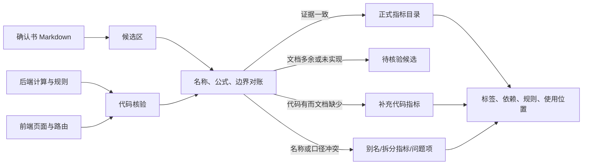

# 统一指标目录、指标查询与口径治理方案

> 更新日期：2026-09-25
>
> 当前分支：`feature-0916-PD-GU`
>
> 范围：教学管理分析、基础报表、系统管理 / 指标查询、系统管理 / 指标与口径管理
>
> 状态：功能已实现，本地开发库已迁移并完成服务回归，待部署环境角色浏览器回归

## 1. 建设目标

系统新增独立菜单“指标查询”，用于统一检索指标定义、标签、上下游引用关系和实际使用位置；原“指标与口径管理”继续承担候选确认、版本和展示配置治理，两者不互相替代。

本次建设解决以下问题：

1. 指标公式、边界、触发规则和预警要求分散，难以查找和统一修改；
2. 指标间存在计算引用，但影响范围不可见；
3. 同一指标可能在多张卡片、图表、列表和下钻中重复使用，原系统无法完整定位；
4. 指标缺少多维标签，同一指标无法同时按业务对象、计算形态、主题和用途检索；
5. 确认书存在遗漏、历史内容和名称差异，不能直接作为已实现指标目录。

目录只登记可追溯的确定性公式和规则，不执行自然语言公式或任意 SQL。学校阈值继续由“分析方案管理”治理，AI 不临时发明正式指标。

## 2. 代码优先的双向核验

### 2.1 核验来源

核验同时使用四类证据：

- 指标确认书 Markdown：形成候选定义，不直接发布；
- 后端路由、ETL、聚合 SQL 和规则代码：确认公式、分子分母、筛选范围和触发条件；
- 前端页面、路由和字段映射：确认展示名称、功能点、卡片/图表/列表/下钻等使用位置；
- 测试和迁移结果：验证依赖闭包、模块层级、权限和幂等性。

双向对账流程如下：



### 2.2 本轮核验结果

| 项目 | 数量 | 说明 |
|---|---:|---|
| Markdown 稳定候选编号 | 224 | 当前文件实际解析结果；旧文档中的 207 已过期 |
| 已关联正式指标的候选 | 68 | 候选编号能与代码核验指标直接对应 |
| 待继续核验候选 | 156 | 仅保留在候选区，不进入“指标查询”正式结果 |
| 治理视图 | 403 | 247 个正式指标与 156 个未关联候选的去重并集 |
| 正式指标 | 247 | 包含确认书指标及代码发现的技术指标、分子分母和判定辅助指标 |
| 当前有效正式指标 | 245 | “指标查询”默认展示范围 |
| 历史停用指标 | 2 | 应届毕业率、学位授予率，仅在显式历史筛选时返回 |
| 指标使用记录 | 375 | 同一功能点内的卡片、Tooltip、图表或下钻可分别留痕 |
| 去重功能点 | 369 | “被使用模块功能点数”的计数口径 |
| 直接引用关系 | 130 | 引用数按直接且去重的指标边计数 |
| 规则绑定 | 61 | 触发、分类、数据质量门槛和证据门槛 |
| 人工核验别名 | 46 | 同义名称、历史名称和明确的跨页面语义映射 |
| 别名记录总数 | 593 | 含页面展示名称和技术键自动生成的可检索别名 |
| 显式问题项 | 25 | 口径、边界、显示或数据证据不一致，不静默修正 |

正式指标数量可以大于文档候选数量：代码中的分子、分母、计数基数、判定辅助量如果参与页面计算或指标依赖，也作为独立可追溯指标登记。

### 2.3 同名、异名处理规则

- 同一语义、不同名称：保留一个稳定指标 ID，其他名称登记为别名；
- 同名、不同语义：拆成不同指标 ID，并登记冲突问题，不用名称强行合并；
- 同一公式、不同业务边界：边界不同即分开登记；
- 文档存在、代码无证据：留在候选区，正式查询不展示；
- 代码存在、文档缺失：以代码证据补充技术指标，并在确认书修订说明中披露；
- 页面展示值与公式不一致：保留真实实现口径并登记问题，待业务确认后统一修改代码和文档。

已登记的典型问题包括：超大班页面写“>120”而 SQL 为“>=120”、课程质量同名 `fail_rate` 在列表和趋势中语义不同、培养方案绑定率存在两种分母、毕业核查人数当前固定返回 0、师资参与率卡片的显示分子分母在回退路径下不可直接相除。

本轮依据指标说明与计算公式示例进一步核对师资代码，补登记代码中实际参与分类、但原目录只作为规则文本存在的“重点课程识别”支撑指标；同时登记“结构核查指标”为 F-10 的业务同义名。重点课程正式范围与关键词、F-10 的 55 岁双侧阈值、F-10 与 F-09 的职称证据来源、F-19 的 90% 年龄覆盖门槛差异均作为显式核验问题保留，未用规格化整理掩盖实现差异。

## 3. 统一存储模型

V2 目录使用 `sys_metric_*` 表族，旧 `sys_metric_definition` 和 `sys_metric_page_binding` 仅保留兼容期。

| 表 | 职责 |
|---|---|
| `sys_metric_candidate` | 保存 Markdown 候选及原始载荷，区分已关联与待核验 |
| `sys_metric_registry` | 指标稳定 ID、技术键、生命周期和当前版本 |
| `sys_metric_version` | 名称、说明、公式、边界、管理价值、数据源、粒度、周期和版本 |
| `sys_metric_version.specification_json` | 正式指标的规格化定义：统计对象/范围/类型、分子分母、去重、纳入排除、边界、空值、精度、时点和数据源 |
| `sys_metric_candidate.specification_json` | Markdown 候选采用同一规格结构，但质量状态固定披露“候选待确认” |
| `sys_metric_spec_override` | 保存人工复核后的字段补丁、原因、证据、优先级和修改人；迁移时形成有效规格，不直接改写原始公式 |
| `sys_metric_alias` | 页面名、技术名、历史名等多名称映射 |
| `sys_metric_tag` / `sys_metric_tag_link` | 多标签字典及指标多对多关系 |
| `sys_metric_module` | 教学管理分析与基础报表的三级模块树 |
| `sys_metric_feature_point` | 页面内 KPI、图表、列表、Tooltip、下钻等功能点 |
| `sys_metric_usage` | 指标与功能点的多对多使用记录及出现位置 |
| `sys_metric_dependency` | 指标直接引用关系，方向为“当前指标引用目标指标” |
| `sys_metric_rule_binding` | 指标与触发、分类、证据或数据质量规则的关系 |
| `sys_metric_evidence` | 后端、前端、ETL 等实现证据 |
| `sys_metric_issue` | 未解决的名称、公式、范围或显示问题 |
| `sys_metric_snapshot` | 候选、正式定义、关系和使用位置的完整发布快照 |

迁移是幂等的；普通查询接口只读，不在请求过程中解析 Markdown 或写数据库。快照摘要覆盖完整公式、边界、标签来源、依赖、规则、使用位置和问题项，任何受治理内容变化都会形成新的摘要。

## 4. 标签体系

一个指标可同时拥有多个标签。当前自动和人工种子共同覆盖：

- 业务域：教学数据总览、学业预警、教学运行、培养质量、师资保障、学生成长、基础报表等；
- 业务对象：课程、学生、教师、班级、学院、专业、教室、培养方案、预警；
- 计算形态：数量、比例、平均值、中位数、排名、分布、变化、得分、状态；
- 分析主题：GPA、挂科、补考、重修、学分、排课、毕业、四级、质量、风险等；
- 管理用途：比较、趋势、优先级、证据核查、资源保障；
- 时间口径：当前、学期、跨学期、累计；
- 数据性质：正式质量指标、候选或证据门槛。

标签筛选为多选“且”语义；例如同时选择“课程”和“通过率”，只返回同时拥有两类标签的指标。

## 5. 页面与交互

### 5.1 菜单与权限

- 系统管理新增独立菜单“指标查询”，路径 `/admin/system/metric-query`；
- 原“指标与口径管理”路径 `/admin/system/kpis` 保留；
- 详情路径 `/admin/system/metric-query/:id` 复用“指标查询”叶子菜单权限；
- 新增 `definition.read` 动作权限，查询接口服务端重新校验；菜单隐藏不是安全边界。

首批开放角色为校领导、教务处、教学运行、教研、实践、质量管理、二级学院院长、教学秘书和系主任。辅导员、班主任、导师和普通教师暂不默认开放。

### 5.2 查询页

查询条件：

1. 模块：三级树形下拉，选择父模块包含全部子模块；
2. 标签分类：可搜索多选下拉；
3. 指标名称：同时匹配正式名称、稳定编号和别名。

结果采用服务端分页，字段为：指标名称、指标详细说明、计算公式、标签分类、使用模块/功能点、引用指标数、被引用指标数、被使用模块功能点数、操作。使用位置采用单行溢出 Tooltip；每行提供“详细”按钮。

### 5.3 详情页

详情页包含：

1. 指标基本信息：名称、指标详细说明、计算公式、标签、使用位置和三项关系数量；指标详细说明直接解释统计对象、范围、组成项、触发条件、去重和边界，计算公式统一使用中文业务规则，不显示 SQL 或英文实现表达；
2. 被引用指标清单：直接使用当前指标的下游指标；
3. 引用指标清单：当前指标直接使用的上游指标；
4. 使用模块/功能点清单：一级模块、二级模块、三级模块、功能点、功能点说明；
5. 规则绑定：显示规则类型、编号、角色和条件；
6. 核验问题：显示问题类型、级别、状态、说明和代码证据来源。

页面不单独展示“规格化口径”区块。结构化字段只在后台用于统一存储、质量校验和人工复核：`complete` 表示现有证据已覆盖必需字段，`needs_review` 表示仍有未确认字段，`mismatch` 表示定义与实现存在明确冲突，`candidate_needs_confirmation` 表示仅来自 Markdown 候选。任何状态都不会执行自然语言公式；原始实现公式、管理用途、中文展示公式和结构化定义分开存储。

两个关系清单均展示完整指标字段，使用模块/功能点列使用溢出 Tooltip。引用数量只统计直接去重关系；影响分析接口另行递归计算全部下游影响。

## 6. 接口

| 接口 | 用途 |
|---|---|
| `GET /api/admin/settings/metric-catalog` | 按模块、标签、名称及兼容条件分页查询；治理页使用 `catalog_scope=governance` |
| `GET /api/admin/settings/metric-catalog/{metric_id}` | 基本信息、上下游、使用点、规则、证据和问题 |
| `GET /api/admin/settings/metric-catalog/{metric_id}/impact` | 递归影响指标及受影响功能点 |
| `GET /api/admin/settings/metric-catalog/summary` | 正式目录、候选和治理摘要 |
| `GET /api/admin/settings/metric-catalog/pages` | 页面/模块引用汇总 |
| `GET /api/admin/settings/metric-catalog/export` | 导出当前筛选的全部结果，不受单页 100 条限制 |

模块筛选参数为 `module_id`，标签多选参数为逗号分隔的 `tag_ids`，名称参数为 `name`。

## 7. 变更与影响分析规则

正式指标变更必须同步检查：

1. 当前版本定义和代码计算；
2. 所有直接上游指标；
3. 全部直接及递归下游指标；
4. 所有卡片、图表、列表、Tooltip、导出和下钻功能点；
5. 规则绑定、问题项和证据；
6. 本确认书对应模块条目与自动化测试。

不同版本不得直接覆盖历史定义。迁移脚本由代码核验种子生成当前版本，生产环境不得手工修改唯一数据库来替代迁移。

## 8. 部署与验收

部署前在目标数据库备份后执行：

```powershell
python -X utf8 code/scripts/migrate_metric_catalog_v2.py
```

系统管理总迁移 `code/scripts/migrate_system_management.py` 已包含该迁移；脚本可重复执行。迁移后必须核对候选数、正式指标数、引用闭包、模块根节点和快照数。

当前自动检查结果：

- V2 迁移连续执行两次结果一致，快照数保持 1；
- 224 个候选、247 个正式指标、245 个当前有效指标；
- 130 条依赖无环、无悬空指标；
- 所有使用位置均归入“教学管理分析”或“基础报表”模块树，无未知根模块；
- 本轮核心指标目录与系统管理 26 个测试全部通过；
- CSV 导出覆盖超过 100 条的完整结果；
- 869 个代码证据文件引用全部存在；
- 前端生产构建通过，共转换 2486 个模块；
- 完整后端 506 个测试中 504 个通过；2 个既有决策金标用例仍依赖陈旧的 `950` 与 `sig-ap-stale` 期望值，与本次目录改造无关；
- `git diff --check` 通过。

发布前仍需完成服务启动后的角色浏览器回归，并处理或重新基线化上述两个决策金标用例。浏览器至少覆盖校领导/教务处、二级学院、无菜单角色、直接 URL、接口权限、详情关系方向和模块/标签组合筛选。

## 9. 后续治理边界

- 25 个问题项是待业务确认或后续修复清单，登记问题不代表已修改原业务算法；
- 156 个待核验候选不会出现在正式“指标查询”结果中，但不会丢失；
- 代码新增页面指标时，必须同时登记定义、标签、依赖、使用点、证据和测试；
- 学校确认口径后升级版本，并同步确认书；
- 本轮不建设第二套公式执行引擎，也不引入图数据库或独立微服务。
